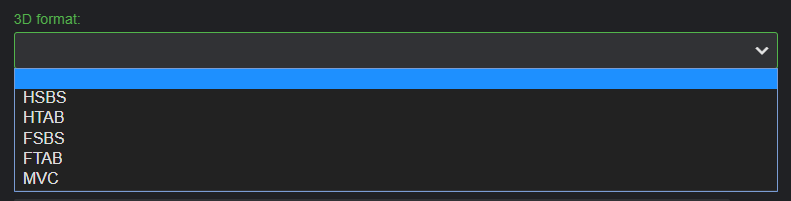

There are mulitple ways to identify a video as 3D.

## Identify using the web interface

A video can be identified as 3D using the the [metadata manager](Metadata-manager). Simply edit a video:


Then select the 3D format:




## Identify using video file name flags

In order to properly detect 3D, two tags need to be present in the filename. First, a '3D' tag has to be present. Second, one of the following must also be present, hsbs, fsbs, sbs, htab, ftab, or mvc.

Tags need be be surrounded be either a space ( ), hyphen -, dot . or underscore _. Tags are case-insensitive, so both 3d and 3D will work.

Examples:

* moviename (year).3d.hsbs.mkv
* moviename (year) 3d sbs.mkv
* moviename (year).3D-HTAB.mkv
* moviename (year)-3D.sbs-720p.mkv
* moviename (year)-3D.mvc.mkv

## Identify using older conventions

Older file naming conventions are still accepted  by placing one of the following tags within the filename:

* [fsbs]
* [ftab]
* [hsbs]
* [htab]
* [3d] - Indicates half side by side
* [sbs3d] - Indicates half side by side

For example:

```
/Movies
   /300 (2006)
     300 (2006) [hsbs].mkv
   /Home Alone (1990)
     Home Alone (1990) [fsbs].mkv
```

## Multiple Versions

3D can even be combined with the multi-version video support discussed in the [Movie Naming](Movie-naming) article.

Here's an example of a movie containing multiple versions in a single movie folder, some 3D and others 2D:

```
/Movies
  /300 (2006)
    /300 (2006) - 1080p.mkv
    /300 (2006) - 720p.mp4
    /300 (2006) - 3d-hsbs.mp4
    /300 (2006) - 3d.hsbs.mp4
    /300 (2006) - 3d.mvc.mp4

```