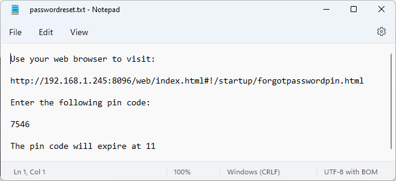

To reset the password of the system administrator there is a special process to follow.  If you have multiple admins setup on your system you can have another admin account reset your password just as they would any other user. If this is the only admin account on the system this will be the method used to reset the master password follow these instructions.

You will need access to the file system of the server itself as a special file is written with instructions.  This prevents a 3rd party from gaining access to your Emby Setup as only the admin of the system should have access to this.

From a web browser open your local server address which could be http://localhost:8096 but do NOT use Emby Connect.

From the above choices click on the Forget Password choice.

Fill in the account name you use to login to Emby with.  In the following the account used is "admin".

Click the Submit button after entering your admin account name.

You will now get a popup message that includes the location to a file on the system you will need to open.

The contents of the file will be different but similar to this:

All that's needed for you to do now is open the new URL, enter the 4 digit code and then follow the prompts to reset your password.

It's a rather simple process but requires access to the file system to make sure only privileged users can perform the reset.