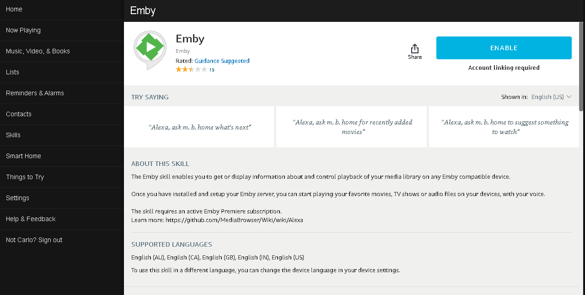
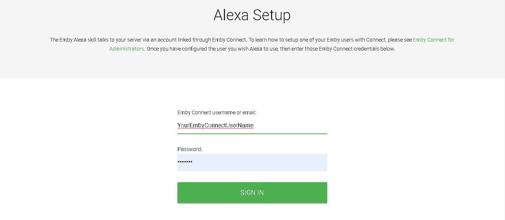
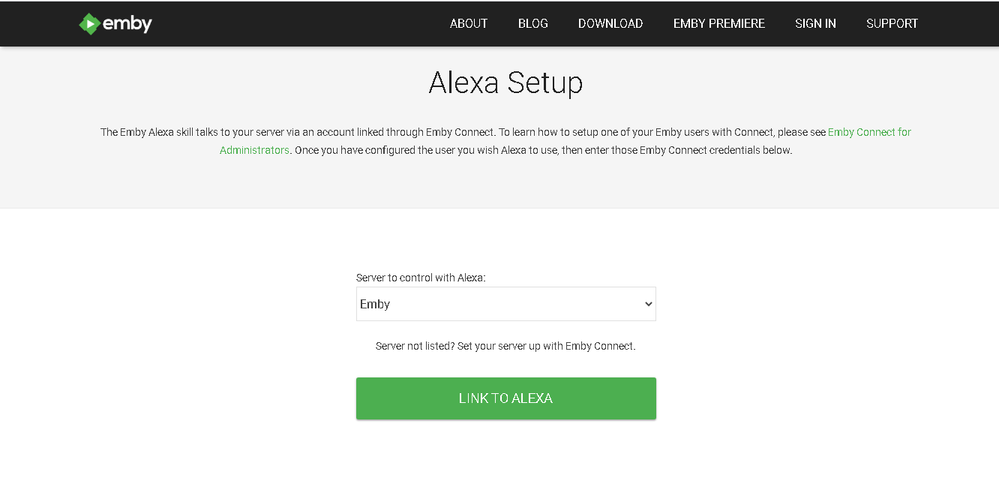
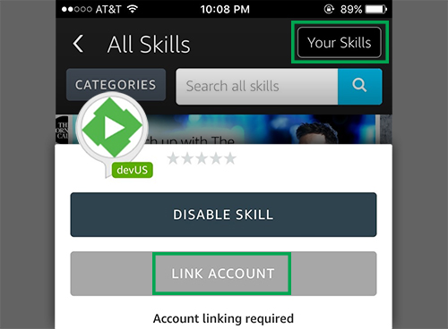

.
## What is Alexa?  

Amazon Alexa is a cloud-based voice service that allows you to retrieve information via voice as well as control device and apps in your Environment including Emby.  You can ask Alexa to play music, hear the news, check weather, control your smart home, and more.
 
The Emby Skill enables users to get information about and control playback of their media library on any Emby compatible device. Once you have successfully linked your Emby account to Alexa, you can start playing your favorite movies, TV shows on your devices with your voice.

## Get started  

The first step is to make sure your Emby Server is setup for remote use and has Emby Premiere..  Since Alexa is a cloud based service it will need access to your Emby server from the Internet.  Please follow our instructions for setting up Remote Access.

At this point please make sure you've already setup your Alexa device following Amazon directions and verify it works for general Alexa use.

You can now setup an Emby Skill to work with Alexa.  You do this by opening the Amazon Amazon Alexa app or the Amazon Alexa web app, navigate to the following:

`Skills > Your Skills > Emby > Link Account`

Click on the Emby Skill

Now Click the Button top right to ENABLE the skill.

Type in your Emby Connect username you created prior to this as well as your password and click the SIGN IN button.

You can now control what Emby server to control. If you only have one server it will be the only choice.  Select your server and click the LINK TO ALEXA button.

You should receive a confirmation screen showing successful linking of your Emby Connect username to Alexa.

You can do a similar setup from your iOS or Android device running the Alexa app

(mobile screen shot)

If you experience any problems please review the information above and if you still have an issue please seek support on our forums and the following location: https://emby.media/community/index.php?/forum/174-amazon-alexa/

### Training Alexa

Alexa may have difficulty understanding the word Emby at first. There are ways to improve this situation.

#### English US only

If Alexa is set to English US, you have access to voice training. Using this, Alexa will start understanding you instead of guessing what you said. In the Amazon Alexa app or the Amazon Alexa web app, navigate to the following:

`Settings > Under Accounts > Voice training`

#### Every languages
The Amazon Alexa app offers feedback cards for skills. This allows Alexa to self-correct, by marking these cards positively or negatively depending on if Alexa understood you or not. In the Amazon Alexa app or the Amazon Alexa web app, navigate to the either:

`Home > Cards regarding Emby > More > Did Alexa understand you?`

`Settings > General > History > Did Alexa do what you wanted?`

### Commands
#### How to use Alexa

- Every command needs to start with: **Alexa, tell/ask m. b. home  -to [insert command]**
- Alternatively, you can start an Emby session with: **Alexa, - start/begin/open m. b. home**  
  The benefit of using an Emby session is it allows you to give  multiple commands without needing to invoke Emby for as long  as the session is active. Sessions are automatically terminated after 8 seconds of inactivity (when the blue ring of your Alexa device fades).
- You can stop whatever Alexa is doing with: **Alexa, cancel/ never-mind**. Alexa will also abandon your request if you don't reply within 8 seconds
- Not all commands are compatible with every Emby apps. If you encounter an issue, post here
- To direct a command to a specific player, append **on another player** or **on [player name]** to the end of your command
- Here is the list of supported media types:
  episode, movie, show, season, song, album, artist, audiobook, channel, playlist
- **Parts of commands in parenthesis given below are optional**

### Using Alexa as a player

Audio playback is supported at this time. This feature requires your server to be secured with ssl encryption. Refer to this guide if you need help. Self-signed certificates are not supported for this.

Ask m. b. home to play music. Specify "on this player" or "on Alexa" at the end of your request to skip the player selection. Once music playback is initiated with the skill, you can use these controls (notice you don't invoke m. b. home):

- Alexa, Next
- Alexa, Previous
- Alexa, Pause
- Alexa, Resume
- Alexa, start over
- Alexa, loop  
  (This is to repeat the currently playing item. Loop off to turn off)

#### Which player?

You can set a player as default. If a device/player name is not included at the end of your command, it will be automatically directed at your default player.

- change the player (to {player or device name})
- change my player to Living Room TV

#### Which Emby user?

By default, the skill will use the same Emby user used to link Alexa to Emby. But it can be changed with the following:

- who is the active user
- change the user (to {Emby username})

#### Additional users

Share the watch status of currently playing content by adding other Emby users to your session.

- who is in the session
- add {user name} to my session
- remove {username} (and {username 2}) from my session

#### Navigation

You can navigate your interface by saying the movement or action related to what you want to do.

- move up/down/left/right
- page up/down
- select
- mute/unmute
- go home
- go to the next/previous letter
- show/display/bring up the context menu/TV guide/search/player menu (osd)/settings

#### Playback

- pause, previous, next, play (the selected content), stop or - stop playback
- set the volume (to {percent})
- change the audio (to {language})
- change/enable/disable subtitles
- change the subtitles (to {language})
- seek to {time} or start from the beginning
- seek to (plus/minus) {time}
- jump to chapter {number}
- go to the next/previous chapter

#### Media Playback

By default, Alexa is set to search video content when the content type is not specified. This means, for any other types, you need to include the content type to yield proper results.

- play (the movie) {movie}
- player (the show) {series}
- resume the episode from {series}
- play the artist {Artist}
- play the song {song} (from {Album}, by {Artist})
- play the audiobook {title}
- tune in channel {name}

#### Here are a few examples

- put on season 2 of Game of Thrones
- play Supernatural, season 5, episode 12
- play the new episode of Gotham
- watch the next episode of Orange is the new black

#### Suggestions

Reply to the suggestion with a yes or a no.

- give me a suggestion
- suggest me a ({genre}) {content type, i.e. movie}
- I don't know what ({episode}) to watch
- what's good?

#### Play random content

- play something
- play a movie (genre {Genre})
- play an episode of {series}
- play a few episodes
- play next up

#### Play random music

- drop the beat
- put on some music (genre {Genre})
- play songs (genre {Genre})
- play songs by {Artist}
- play songs from the album {Album}

#### Recently added

- what's new
- what's been recently added?
- what {content type, i.e. movie} is newly added

#### Next Up

- what's next
- what is up next

#### Continue playing

- what can I keep watching?
- what (show/movie/audio book) was I in the middle of?

#### Item modification

- remove {title} from my favorites
- add ({content type, i.e. movie}) {title} to my favorites
- I love the {media type, i.e. music video} {music video}
- set/mark {media type, i.e. movie} {title} as watched/unwatched

#### Transfer or Copy playback between devices

Transfer will stop playback first. Copy will simply resume playback where you left off, on the device of your choice. By default, it will fill in the missing information with your default player.

- transfer/copy the stream/playback (from {player}) (to  {player})
- switch/copy the stream/playback (to {player}) (from {player})

For example
- Transfer the playback from chrome to theater.
- Copy playback to iphone. omitting the origin of the playback 
will automatically grab it from your default player

#### Help
If you are ever uncertain what commands the player supports, ask Emby for:

- the available commands
- help

## Change your Emby connect account

You can easily replace the Emby connect account linked to Alexa. First, you will need to disable the Emby skill. Then, once re-enabled, go though the account linking process again as show above.
