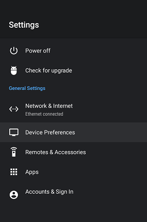

Before starting the attachment process please make sure any NAS or File Server you will be attaching to is named using all CAPS. If not the android device will not be able to access your files. This is a critical step needed before continuing.

The steps needed on Android TV to attach network storage involve clicking the gear icon on the Android TV homepage. This will bring up the SETTINGS page.

Scroll down to Device Preferences and click it.

Now scroll down to Storage and click on that.

Scroll down to Mount network storage and click on that.

You will now see servers and NAS boxes that have been setup on your network with shared folders.  In this example we'll be using the EMBYSERVER machine.  Scroll down to the proper server on your network and click on it.

You will now select the Connect as a registered user choice and click it.  Not shown will be two follow up screens that require you to enter a valid username and a valid password that you have setup on the server.  Once completed you should have a screen similar to this.

This shows that the server is Connected and is ready for use.