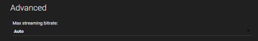

Emby for Android Mobile is available in multiple ways:
* [Amazon App Store](http://www.amazon.com/Emby-for-Android/dp/B00GVH9O0I)
* [Google Play Store](https://play.google.com/store/apps/details?id=com.mb.android)
* [APK Download](http://emby.media/emby-for-android-mobile.html)

Emby for Android Mobile can handle just about any type of media thanks to [Emby Server transcoding](Transcoding). If you would like to learn how to prepare your media for Direct Play, read below.

# Setup Guide

Install the app using one of the above methods, then use the startup wizard to connect to your Emby Server.

# Direct Play Media Formats

* Video — m4v,3gp,mov,xvid,vob,mkv,wmv,asf,ogm,ogv,m2v,avi,mpg,mpeg,mp4,webm
* Subtitles - srt,vobsub,pgs,ssa,ass,sub,vtt
* Audio – aac,mp3,mpa,wav,wma,mp2,ogg,oga,webma,ape,opus,flac

# Best Practices for Direct Play

* Ensure your media meets the above criteria.

* Leave the app's streaming bitrate setting on the default value of Auto, if possible. The app will perform bandwidth tests with your Emby Server to determine the maximum playable bitrate.

* If you are customizing the bitrate setting, then you will need to compare the bitrate of your files to the bitrate setting in the app. You can find the bitrate of a file by checking the media info in the web interface. If the bitrate of a file is higher than the setting in the app, transcoding will be required. Increasing the bitrate setting in the app can help reduce transcoding, but may impact playback performance if your network connection is not fast enough to handle it.

# Chromecast

The app supports casting to Chromecast devices. To connect to your Chromecast device, simply click the cast icon in the top right corner of the app. You'll then be asked which device you'd like to connect to.

Once connected, any content you play will be sent to the Chromecast device. You're able to play individual files, entire folders, shuffle, instant mix, queue, and more.

For more information, see [Chromecast](Chromecast).