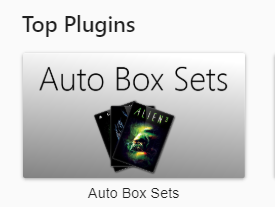
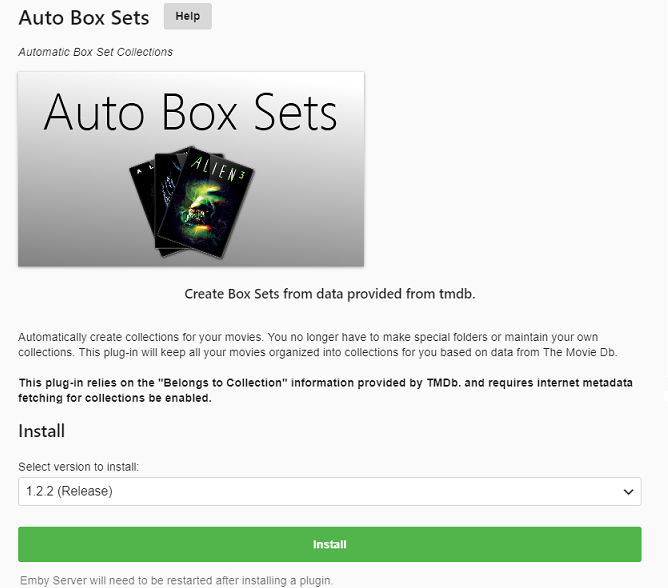
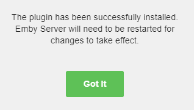
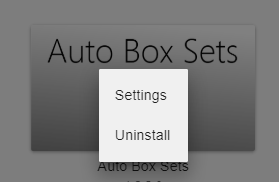
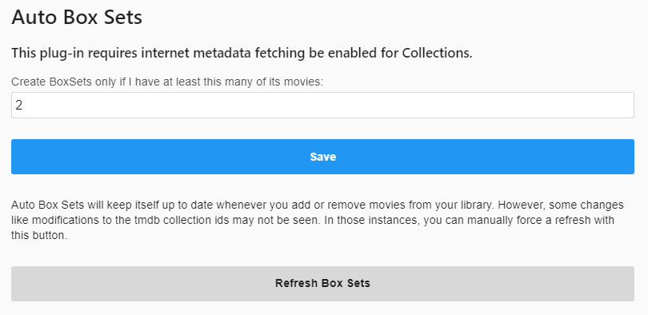

Automatically create collections for your movies. You no longer have to make special folders or maintain your own collections. This plug-in will keep all your movies organized into collections for you, based on the same **TmdbCollectionId** data from [The Movie DB](https://www.themoviedb.org/). 

To install the plugin, click **Plugins** in the side-bar menu of the Emby server dashboard, and select the **Catalogue** tab.

Scroll down to the **General** section of the page, and click on the plugin image.

Click on **Install**.

Once install, Emby will inform you that the server needs to be restarted.

When the server has restarted, click **Plugins** in the side-bar menu of the Emby server dashboard, and select the **My Plugins** tab.

You will see the **AutoBoxSets** plugin listed (along with any other plugins already installed), where you can open the settings page, by clicking on the AutoBoxSets artwork to bring up the menu.

You can manually force a refresh of the AutoBoxSets with the **Refresh Box Sets** button.
 

### Trouble Shooting

If movies are not added to the collection as expected, check that the **TmdbCollectionId** ID for your media is correct on [The Movie DB website](https://www.themoviedb.org/). Also check to make sure your media has the same **TmdbCollectionId** set in it's own metadata.  If not try to manually refresh the meta-data on the individual media items you are trying to add to the collection.

Once this is confirmed, you can then manually force a refresh of the AutoBoxSets via the **Refresh Box Sets** button in the AutoBoxSets Plugin configuration page (see above).

Note: If you experience issues with AutoBoxSets after upgrading to Emby Server version 4 please make sure to run a full scan by clicking the button "Scan All Libraries" at the top of your list of Libraries when access from the Library menu option.
