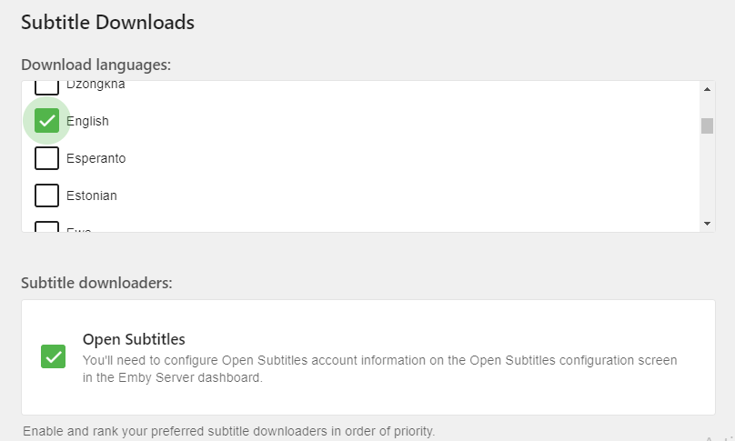
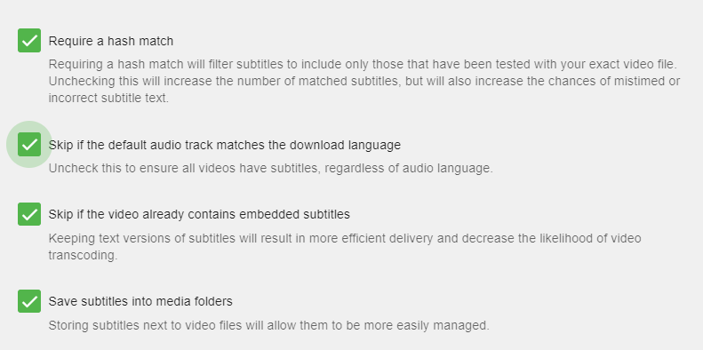

Emby can automatically download subtitle files for your media.  There are multiple subtitle plugin that can be used.

## Install a Subtitle Plugin
Before being able to setup automatic downloading of subtitles you will need to setup a plugin such as [Open Subtitles](Open-Subtitles). Please make sure you have configured your plugin before continuing.

## Setup your libraries to download subtitles
Once you've installed a subtitle plugin, restarted the server and configured the plugin you are ready to configure each of your libraries to use the plugin.

You can now edit or setup a new library.  When editing a library make sure to click the top right option "show advanced settings".  You can now scroll down to find the following items.

There are two options shown above.  You will want to configure the language preference of any subtitles you want to download.  The above picture shows English subtitles chosen for download.

The second option will show any subtitle plugins you may have installed.  In this case only Open Subtitles is shown and selected.

The above picture shows several options available for you to configure. These should be self explanatory with possibly the exception of "Require a hash match". If this option is enabled as shown, then subtitles will ONLY be downloaded when your media file matches EXACTLY "byte for byte" with the Open Subtitle's database.  If you're ripping your own titles or using the DVR service to record files you will never get a hash match and will not be able to use this option.

Subtitles will now be downloaded as needed when available, via the Download Subtitles [Scheduled Task](Scheduled-tasks).

## If Subtitles are not automatically downloading
If subtitles are not automatically downloading you should check the options listed above.  For example "Require a hash match" requires your media file to exactly match (byte for byte) the source file of the subtitle.  This option when activated can greatly reduce your chances of downloading subtitles but will make sure the subtitle is "perfect" for you file.

You should also check the following link to see how to manage [Manual Subtitle Downloads](Manual-Subtitle-Downloads).
## Tips
Emby supports many subtitle providers including: Addic7ed, NapiSub, OpenSubtitles, Podnapisi & SubDb. You can find the latest list in the [Plugins](Plugins) Catalog.