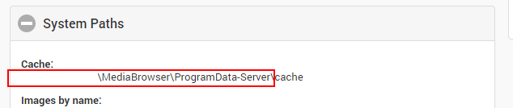

This guide will go over how to migrate your settings from Emby Server from one machine to another. There are two methods to backing up Emby Server settings and we'll go over them here.

## Use the Emby Backup Plugin

We recommend using the Emby Backup plugin, which is designed to make this process really painless by doing the work for you. Emby Backup requires Emby Premiere and can be found in our plugin catalog.

The Emby Backup plugin can help you backup and restore the following:

* Server configuration
* Users
* User data (playstates, favorites, etc).
* Installed plugins
* Plugin settings
* Playlists

This will not backup library contents and metadata. To keep a permanent copy of metadata, we suggest enabling saving of local metadata to media folders.

## How to use the Emby Backup Plugin
* Be sure your Emby Premiere key is properly installed and validated.  Configuration Backup requires Emby Premiere.
* Install the plugin into your existing Emby Server
* Configure the Backup plugin by setting a folder to save the backups within.
By default, this process will run every 12 hours and will retain at most 3 backups. You can monitor your folder to see that backups are created.
* Install the plugin on your new Emby Server installation, then configure to backup folder to the same folder that contains your backups.
* Click on a backup, you'll then be taken to the restore screen where you can run a restore.
You're done !

If you prefer to backup manually, read on....

## How to Backup Manually

The following instructions will detail how to manually backup or migrate an Emby Server installation.

### Locate Emby's program data folder

Open the server dashboard and expand the System Paths section. Locate the program data folder by referring to the outline in this screenshot.

From now on this guide will refer to this path as /ProgramData.

### Review Paths on the Old Setup

Take a look at the configuration on your old server instance. Review any paths you've configured into the server such as cache folders, channel download folders, transcoding folders, as well as any paths configured within plugins. The new server will need to be able to reach these paths, and generally will require write access. If this isn't the case, then various components of the new server may have problems. If you're in doubt, revert these settings to their defaults before proceeding.

### Backup Files

Shutdown the old server instance and backup the following files and directories:
* /ProgramData/config
* /ProgramData/plugins
* /ProgramData/data/collections
* /ProgramData/data/playlists
* /ProgramData/data/displaypreferences.db/ProgramData/data/userdata_v2.db (if present)
* /ProgramData/data/users.db

Additionally, backup the library database file, but put it into a separate place from the others. This file will not be copied into your new Emby Server installation, but we will migrate your user data, such as watched data, favorites, etc.
/ProgramData/data/library.db
This will backup saved configurations, installed plugins, collections you've created, playlists, display preferences and the user database.

**Note**:  Unless you use a custom Metadata path you will want to backup your /ProgramData/metadata folder to preserve your People images.  The only two folder in metadata you don't need are library and views.

### Install Emby Server on the new machine

Install Emby on the new machine as you normally would. When the startup wizard launches in the browser, do not complete it and instead shut down the server.

Now take all of the files you backed up from the old server and copy them into the equivalent locations on the new server.

Then launch the new server, sign into the dashboard and setup your library paths. Allow the scan to complete as normal.

### After the Scan

If your library was configured with identical paths as the old setup then user data will generally be preserved as well as user library permissions. You may still want to review the library access for each user to ensure their channel and folder access is restricted as desired.

### Restore User Data

Your user data is stored in our old library.db file, and we'll need to run some sql queries to import this into the new library.db in the new Emby Server installation. You'll need a Sqlite database editor such as DB Browser for Sqlite.

You'll need to open the old library.db file, then attach the new library.db file. You can then migrate the data using:
`REPLACE INTO NewDB.userdatas SELECT * FROM userdatas`