This guide will go over the following:
* how to setup regular backups using the Backup & Restore Plugin
* how to migrate your settings from Emby Server from one machine to another
* how to restore the same configuration to a new additional server
* how to restore your server to the last backed up state
* how to restore your server to a specific date backup of the databases
* how to copy playback state and favorites from one user account to another

There is also a section on manual backups.

## Use the Backup & Restore Plugin

We recommend using the Backup & Restore plugin, which is designed to make this process really painless by doing the work for you. This plugin requires [Emby Premiere](Emby-Premiere.md) and can be found in our plugin catalog.

The Backup & Restore plugin can help you backup and restore the following:

* Server configuration
* Users
* User data: play-states & favorites
* Plugin settings
* Playlists
* Live TV Schedule 

This will not backup library contents and metadata. To keep a permanent copy of metadata, we suggest enabling saving of local metadata to media folders.

> [!Note]
> If you have configured camera uploads and/or Live TV recordings, the default directories for these (data\camerauploads and data\livetv\recordings) are not part of the backup. You would need to back these up yourself and re-instate on the target new location.

> [!Note]
> When migrating to a new machine, media paths will need to remain the same as on the original server.

> [!IMPORTANT]
> Backups created on older versions of Emby Server are not compatible and cannot be restored into Emby Server 4.8.

## How to use the Backup & Restore Plugin
* Be sure your Emby Premiere key is properly installed and validated.  Backup & Restore requires [Emby Premiere](Emby-Premiere.md) .
* Install the plugin into your existing Emby Server.
* Make sure there are no pending updates to the plugin, requiring a server restart to be applied. Restart the Emby Server to apply the updates if the server dashboard indicates that.
* Launch **Backup & Restore** from within the Emby Server Advanced settings sidebar.
* Configure the Backup plugin by setting a folder to save the backups within. If you wish to keep additional  backups of the database files, you can specify that. By default, only one backup set of the databases is produced. Make sure you click **Save** to save the path and number of additional database backups configured.

**Initial Settings**

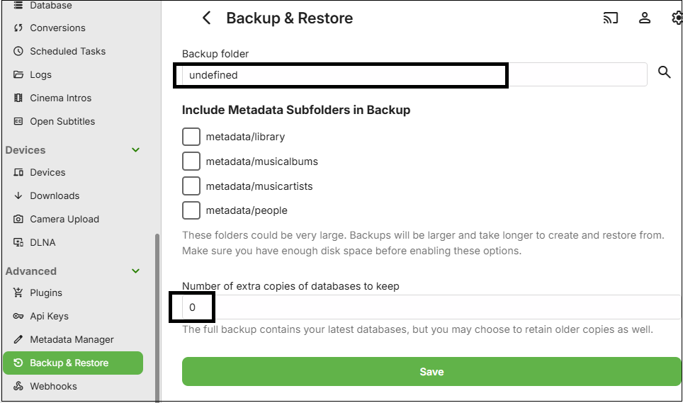
 
Enter the backups path and optionally the number of additional database backup copies retained.

* Now click **Save**.

> [!Important]
> You must set a path for backups by changing the default "undefined" path setting to an actual path and saving that for the backups to start. Please ensure that the system user account that Emby Server runs in, has full permissions to this backups path. Paths must be absolute and not relative.

> [!Note]
> If running Emby Server on Windows as a Windows Service, the backup path needs to be to a local drive or using UNC path if it is an external shared network drive. This is because Mapped Network Drives would not be available to a Windows Service. e.g. Use "\\\server-name\share-name\backups-folder-name" as path and not a mapped network drive.
 

* By default, the backup process will run once a day soon after midnight. This can be changed in **Scheduled Tasks** settings.

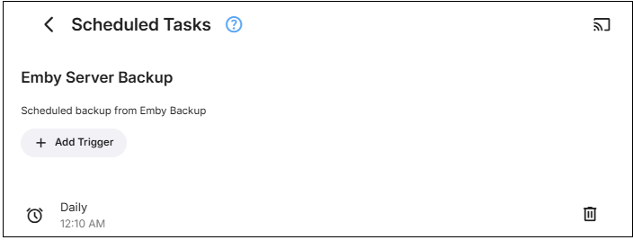

* In Scheduled Tasks, you can manually run the schedule for **"Emby Server Backup"** after backups setup, if you wish to confirm that the backups succeed, rather than wait for the scheduled task to run later on.

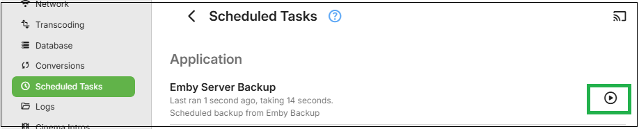

> [!Note]
> Keep a record of what plugins you add to the Emby Server, as whilst the backup operation does save the configurations of all installed plugins, any added plugins will need to be manually installed after the restore of the server.
 
 
## How to restore using the Backup & Restore Plugin

### Restoring to a new server installation
* Ensure all media is in place on the new server in the same media filesystem paths as before. Any that were within the emby server program data eg the default Camera Upload folder and Live TV Recordings folders need to be copied to within the program data path for the new server.
* Add the Emby Premiere key and install the plugin on your new Emby Server installation. You may need to restart the server to complete installing updates for the Backup & Restore plugin.
* Launch the Backup & Restore plugin on the new server and configure it to have the backup path set to where the backups are. It needs to be the same parent folder that contains your backups and then save this path.
* If the path is correct, after clicking "Save" you will see the available backup to restore from.

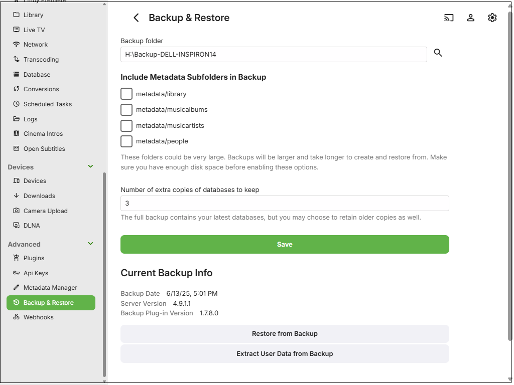

> [!Note]
> if previous backups do not show up correctly, check to make sure you have selected the parent folder and not the specific folder holding the backups.

* Click on **"Restore from Backup"** and in the **Restore Options** drop-down, select **"embyserver-backup-full"**.

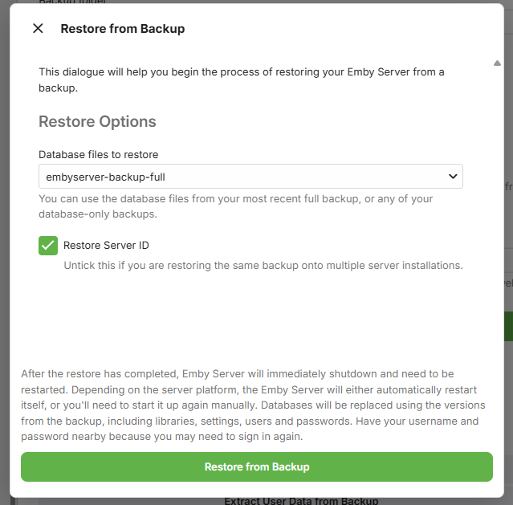

* If this new server is a replacement for the old server, ensure you have the **"Restore Server ID"** ticked.
* If this new server is an additional server, that will be run alongside the server from which the backup was produced, then you must un-tick the **"Restore Server ID"** option, and if using [Emby Connect](Emby-Connect.md), re-link local accounts to Emby Connect after the restore. See [Emby Connect for Users](Emby-Connect-for-Users.md).
* Click on **"Restore from Backup"**
* You will be prompted to confirm.

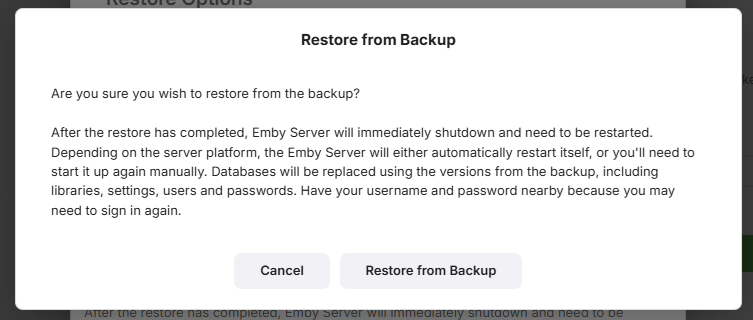

* When the restore completes, Emby Server will automatically restart.

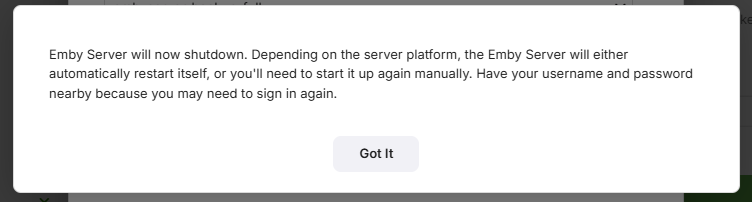

* Make sure you close all previous browser sessions accessing this new server, as they would be using the old pre-restore credentials.
* Install any Plugins that you had added to the server that is being restored. The configuration files are automatically restored, so once the plugins are added and the server restarted to complete the plugins installation, the plugin configuration files should get picked up.
* If you have Live TV configured, go to server settings / Live TV and perform a "Refresh Guide Data"

 

## How to Restore an earlier backup of the databases
* If you have specified that the backups keep a number of extra backup copies of the databases, you can use Restore to revert to an earlier backup of the databases. The restore will use the last full backup data but the databases will be from the backup date you select.
* Launch **Backup & Restore** from within the Emby Server Advanced settings sidebar.
* Click on **"Restore from Backup"** and in the **Restore Options** section, open the drop-down to see the list of previous databases copies.

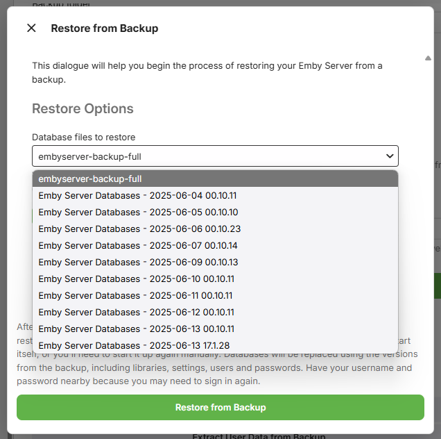

* Select the backup for the day/time you wish to go back to.
* As this restore is not for a new additional server, keep the **"Restore Server ID"** ticked
* Click on **"Restore from Backup"**
* You will be prompted to confirm. When the restore completes, Emby Server will automatically restart.
* Make sure you close all previous browser sessions accessing this new server, as credentials may change.

## How to use Restore to copy media playback state and favorites
You can use Backup and Restore to copy the playback state and favorites information to a different Emby user account.

* Launch **Backup & Restore** from within the Emby Server Advanced settings sidebar.
* Click on **"Extract User Data from Backup"**

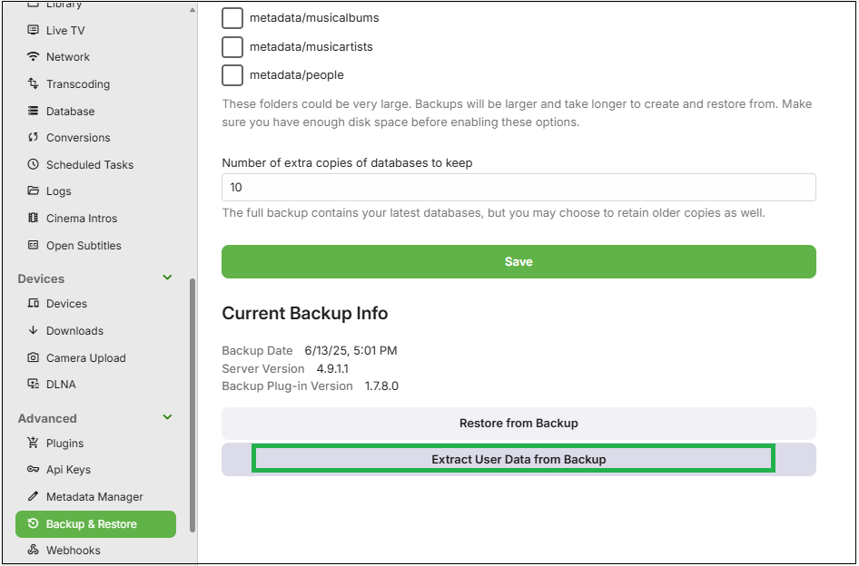
 
* On the next screen, Un-tick all original user accounts that are in the backup except for the one(s) that you wish to copy their data from.
* For each of the selected original user accounts that are in the backup, select from the dropdown the local user account to copy the playbacks state and favorites to.

In the example below, we are copying playbacks state and favorites from user **My-Admin-User** to user **MyNewAdmin**.

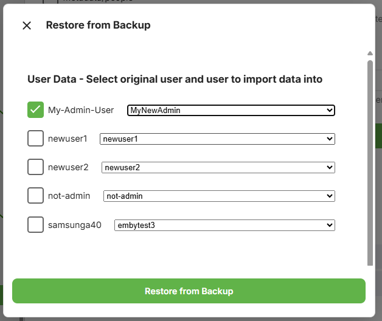

* Having made the selection, now click **"Restore from Backup"**

and as per other restores, you will be asked to confirm.

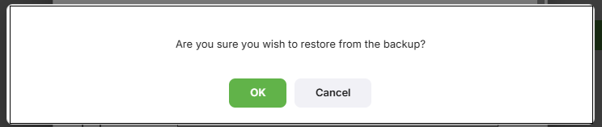

If you prefer to backup manually, read on....

## How to Backup Manually

The following instructions will detail how to manually backup or migrate an Emby Server installation. 

> [!Important]
> It is important that the Emby Server process is not running when files are backed up.

### Locate Emby's program data folder

The path to the [Emby Server Data Folder](Server-Data-Folder.md) can be found in your Emby Server Dashboard by clicking the 3-dot menu next to the server name.

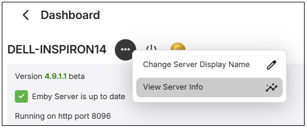

Click the view server info menu choice

The following shows different examples for a number of platforms

**Windows**

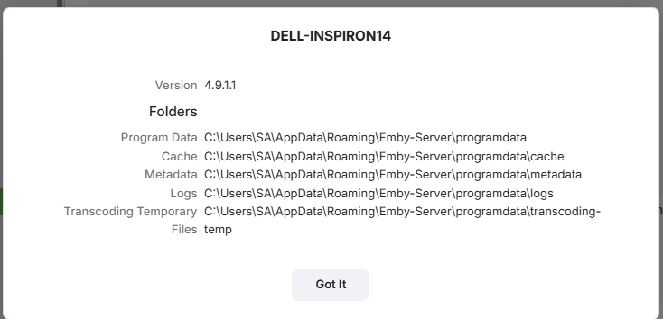

**Synology NAS**

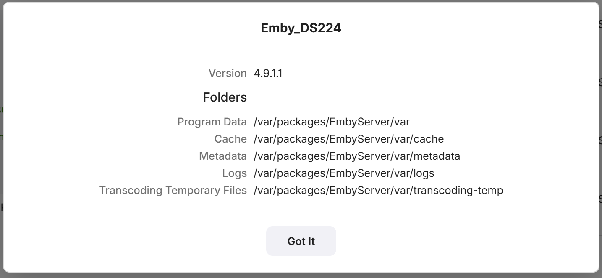

**Linux**

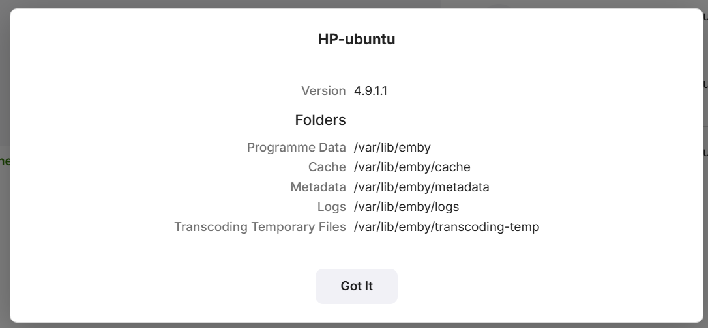

**Western Digital NAS**

The top path entry shows the parent location for Emby Server app data.

From now on this guide will refer to this path as /ProgramData.
Simply backup everything in and below /ProgramData using any tool you wish or copy all files to a backup location. Make sure Emby Server is shutdown and does not show as running in the processes list, activity monitor on Mac, Task Manager on windows. For NAS devices, use the NAS dashboard to stop the Emby Server process.

### Migrate to a new server

If you are migrating to a different operating system care should be care should be used to make sure you match up directories properly during the restore as the directory names and locations could be different.

 - Get a good backup as explained above from you existing system (old).
 - Install the same version number of Emby Server to the computer about to become your (new) system.
 - After running through the setup wizard, shut down Emby Server
 - If space allows, make a copy of the installation to another location on disk. This is only needed if you need to check/fix access rights.
 - Restore the backup from your old machine right over the current installation on the new system.
 - Compare each folder's access rights on the new machine restore to the fresh installation copy.
 - Adjust access rights as needed so they match
 - Start Emby Server.
 - Make any adjustments to file location you may need to make.
 - Run a full library scan on all libraries.
 - Review log files for any errors generated.

### After the Scan

If your library was configured with identical paths as the old setup then user data will generally be preserved as well as user library permissions. You may still want to review the library access for each user to ensure their channel and folder access is restricted as desired.
