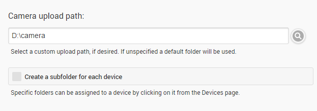

Camera upload allows automatic uploading of photos taken from mobile devices to your Emby Server. It requires Emby apps installed on your mobile devices as well as for the app to support the feature.

Currently, the apps that support automatic camera upload are:

* Android
* Ember for Emby (third party app)

## Enabling Camera Upload

To enable camera upload for an Emby app, you'll need to first enable it within the app's settings menu.

## Customizing the Upload Location

There are a few options that allow you to control where the uploaded photos are saved to. By default, they are saved to an internal data folder, and all devices upload to the same folder. You can easily change the upload folder to a custom path, and/or you can also have a sub-folder created for each device.

To access these settings, open the Emby Server dashboard and navigate to Devices -> Camera Upload.

**Note**: When using a custom upload path, you will need to add that path to the server library.

It is also possible to assign a custom upload path individually for a device. For more information on this, see [device settings](Devices).

## Uploading from Apps

Uploading is automatic and does not require any intervention on the part of the user. Please note that some apps will only upload under certain conditions, such as being on wifi, having a certain connection speed, or a certain battery charge percentage, as well as other device-specific factors. 