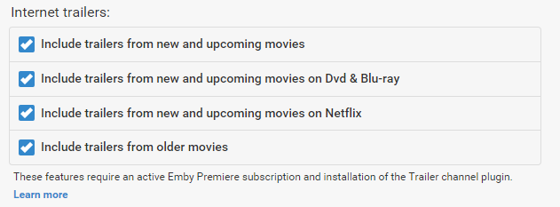
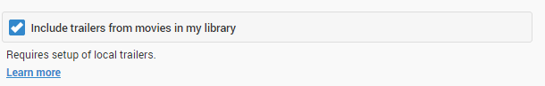
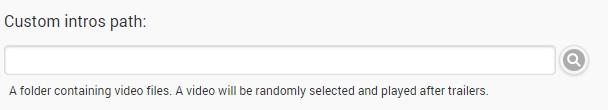
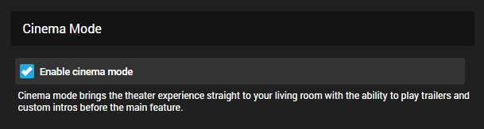

Cinema Intros brings the theater experience straight to your living room with the ability to play trailers and custom intros before the main feature.

Cinema Intros is configured in the server dashboard by navigating to **Playback** -> **Cinema Intros**. By default it is disabled.

## Choosing when to enable Cinema Intros

The configuration page allows you to choose the types of videos that will trigger cinema intros. Currently, Movies and Episodes are supported. A video is determined to be a Movie or Episode based upon the content type chosen when setting up the library.

## Internet Trailers

A vast library of internet trailers are available for use with cinema intros. The categories available are movies coming soon to theaters, movies coming soon to Dvd, and movies coming soon to Netflix.

This feature has two requirements:

* An [active Emby Premiere subscription](http://emby.media/donate)
* Installation of the [Trailer plugin](Plugins), either before or after enabling cinema intros.

## Local Trailers

If your movie folders contain local trailers, enabling this option will allow these trailers to be used within cinema intros. See [trailers](Trailers) for more information.

## Custom Intros

In addition you can specify your own custom videos to be used with cinema intros. Simply create a folder containing the videos, and enter the path in the custom intro field:

**Important**: Make sure to run a library scan after adding new intro files.

## Codec Intros

Codec intros allow you to create intros based on the media information of the main feature you are watching. For example, if you're watching a movie with AC3 audio, you can create an ac3 intro called ac3.mp4, and place this in your codec intro path.

The following fields are used to determine a match:

* Video Codec
* Audio Codec
* Audio Profile
* Tags

Here are some examples:

* A movie has h264 video, intro file is named "h264.mp4"
* A movie has ac3 audio, intro file is named "ac3.mkv"
* A movie has DTS-HD MA audio profile, intro file is named "dts-hd ma.avi"
* You've added a tag to a movie called "waffle", intro file is named "waffle.mpg".

**Tip**: To review the media information for one of your videos, visit the detail screen in the web app.

Simply create a folder containing the videos, and enter the path in the codec intro field:

**Important**: Make sure to run a library scan after adding new intro files.

## Parental Control

Smart parental control will compare the ratings of trailers against the rating of the movie being played, and filter the trailers based on ratings of an equal or lower value. For example, you might be an adult watching The Goonies with your children. The Goonies is rated PG, so this setting will exclude any trailers with a higher rating than PG. Unrated trailers will also be excluded.

The unwatched setting will prevent trailers that you've already seen from being used again, as well as trailers from movies that you've already seen. Note that enabling this setting may eventually result in no unwatched trailers being available.

## User Control

Once you've enabled cinema intros in the server dashboard, they'll be turned on for all users by default. Each user can opt-out of cinema intros individually by disabling it in their user profile settings.

This is accessed by clicking the user icon in the top right hand corner of the web interface, then selecting **Preferences**-> **Profile**.

As an administrator, if you would like to personally change this for a user, you can access this page from the **Server Dashboard** -> **Users** -> **Click User** -> **Edit this user's profile settings**.