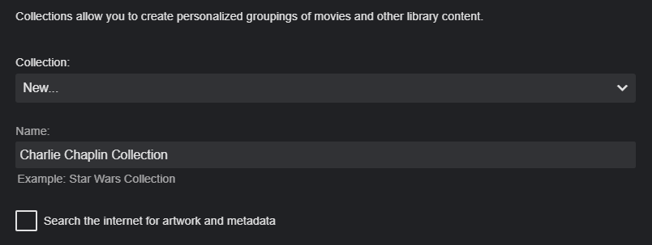
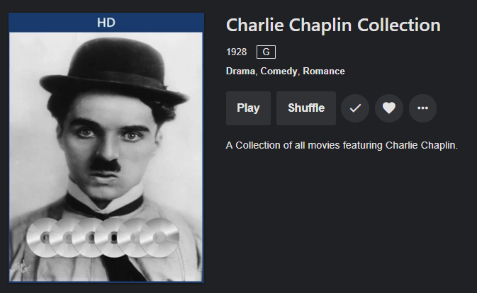
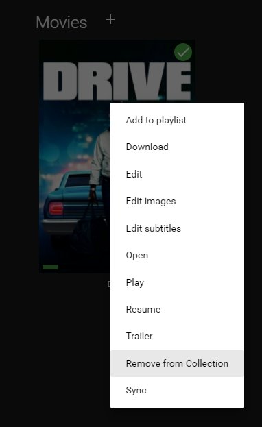
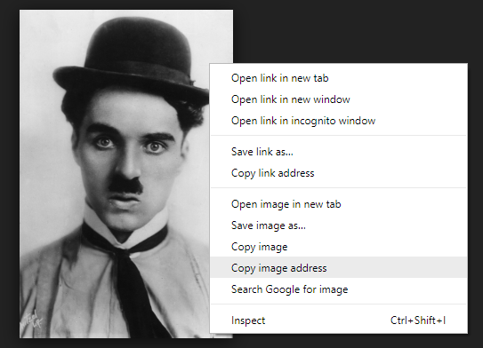
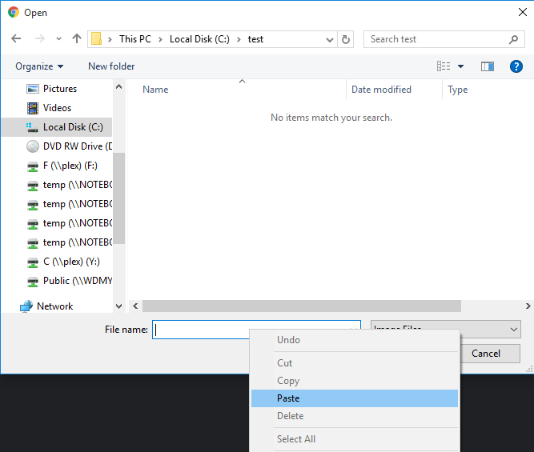

.
## TODO: This is the original Wiki content
Collections are simply a grouping of like content.  You could for example have a collection of James Bond Movies, a set of similar titles like "Back to the Future" or a collection of titles related to a director, actor or even awards.

Collections are generally used to group movies together but can be used for TV Series and other library content as well.

## How to Create a Manual Collection

To create a collection in the web interface, start with a Movie, Series, or other item in your Emby library. Open the context menu for that item using one of the following methods:

* Right click on the poster
* Use the 3-Dot menu on the detail screen
* Mouse over the poster and use the 3-Dot menu

When the context menu appears, select "Add to Collection". You'll then be presented with a popup where you can add the item to an existing collection, or create a new one.

Here is an example of a collection useful for grouping movies to a particular artist such as Charlie Chaplin.

First we long press on the first poster we wish to add until we get this

Next we click the top left box to select additional movies and then we click the 3 dot menu top right.

We fill in the proper information and click OK to create a new collection.

We now have a collection added for Charlie Chaplin without poster art or meta-data. 

We can now edit the information shown for the collection by clicking the 3 dot menu and choosing “Edit metadata” from the popup menu as shown below. When finished remember to click Save.

We manually add cover art doing a similar process.  We click the 3 dot menu and select “Edit images" from the popup menu.

We now click the PLUS sign above to arrive at this screen

From here you have a couple of choices.  You can drag and drop an image into the dashed box or you can click the Browse button to navigate to a local image on your computer.  (also see tip at the bottom of the pages for loading images directly from the internet)

We can now see the image has been imported into the Emby dialog and we are ready to upload it by clicking the Upload button.  It will now be added to the server.

We could add additional images if needed but since we only require one image for our needs we will click the left arrow at the top of the dialog.

We now have a completed manual collection that we have edited.  As you can see in the picture and from the edit metadata menu there is additional information you can edit such as ratings, year, genres and other information.

## Removing Items from a Collection

To remove an item from a collection, first browse to the detail screen for that collection. Each item in the collection will have a 3-dot menu. 

To remove an item, click the 3-dot menu, then select "Remove from Collection".

NOTE: It's important to understand that collections are bound to the location of the media at the time the collection is created.  If you move any file that is part of a collection or change a library type from drive letter to UNC or vice versa this will break the collection.  You can manually edit or migrate your collections using the following advanced topic.
* [Collections – Manual Migration](Collections-Manual-Migration.md)

## How to Create Collection Automatically
Collections for Movies can automated by use of the [AutoBoxSets](AutoBoxSets.md) Plugin. This plugin will create collections based on "boxed sets" such as a "Back to the Future" or "Terminator" collection.

## Tips
### Naming your manual collections
When creating a manual collection, you use a name as found on TheMovieDb.org.  This will make it easy for Emby to automatically download image art and meta-data for the new collection.

You can check the name on TheMovieDb.Org by doing a “collection” search on their site like "Star Wars Collection".  In this case it would return 4 collections you can match against:
* Star Wars Collection
* Lego Star Wars Collection
* Robot Chicken: Star Wars Collection
* Star Wars: The Ewok Adventures Collection

### Using artwork directly from the Internet
Besides navigating and selecting local files there is a neat trick you can use to automatically download internet artwork.

If you open a new tab in your browser you can do a Google Image search for Charlie Chaplin.  Once you find an image that interests you right click the artwork and click the “Copy image address” option.

Now instead of browsing a local file to upload to your server from the dialog box we paste the link as shown below.

After pasting in the link click the Windows Open button and Emby will import the image.