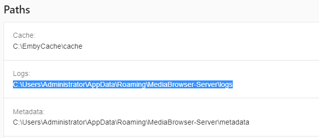
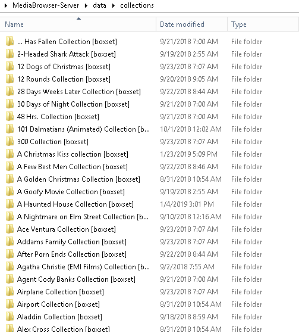
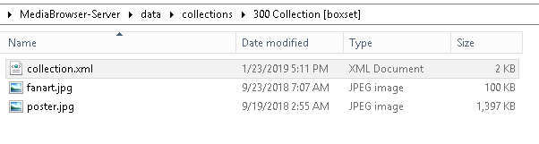
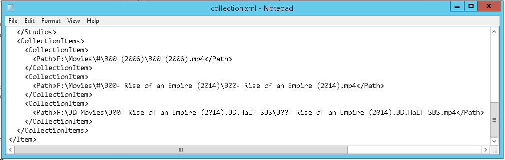
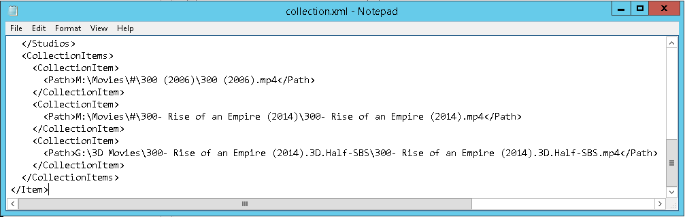

If you ever move you content around on disk after you have already created collections you will need to either rebuild those collections using the Web GUI or you can manually edit the individual text files that hold all collection info.
This tutorial will cover how to manually edit your collection info.

The files that hold collection information are stored in the “data\collections” folder which is directly under your Emby Server folder.

If on Windows it can look something like:

C:\Users\SomeUserNameHere\AppData\Roaming\MediaBrowser-Server\data\collections

An easy way to find this folder on ANY OS Emby runs on is to go to your Web Dashboard and scroll down the right side until you get to the PATHS section which will look something like this:

If you look at either the LOGS or METADATA entries and remove the last part of the folder name you would have (in this example): 
C:\Users\Administrator\AppData\Roaming\MediaBrowser-Server\

Add “data\collections” to the end of that line to arrive at:
C:\Users\Administrator\AppData\Roaming\MediaBrowser-Server\data\collections

This folder will contain our list of collections which will look something like this:

Each of these folders represents one collection.  If we enter a folder such as the 300 Collection shown above we will have a few files that will look similar to this.

You can see we have some fanart and a poster as well as the collection.xml file which will hold the information we plan to edit.  You can edit this with any text edit such as NotePad or Notepad++.  We’ll use Windows Notepad in this example.

Once opened in Notepad we’ve scrolled down to the bottom of the file where the paths are located. 
You can see in this collection there are 3 files. Two normal videos and one 3D version.  The paths are:
* F:\Movies\#\300 (2006)\300 (2006).mp4
* F:\Movies\#\300- Rise of an Empire (2014)\300- Rise of an Empire (2014).mp4
* F:\3D Movies\300- Rise of an Empire (2014).3D.Half-SBS\300- Rise of an Empire (2014).3D.Half-SBS.mp4

Assuming we have moved all of our 3D movies to Drive G and moved our normal moves (first two) to drive M we would have:
* M:\Movies\#\300 (2006)\300 (2006).mp4
* M:\Movies\#\300- Rise of an Empire (2014)\300- Rise of an Empire (2014).mp4
* G:\3D Movies\300- Rise of an Empire (2014).3D.Half-SBS\300- Rise of an Empire (2014).3D.Half-SBS.mp4

All we need to do is edit the PATHS show above in Notepad so it looks like this:

Save your changes in Notepad and repeat for the next collection you need to change.

NOTE: Please make sure the paths you use exactly match the way you set your library up.  If for example you setup your library using: "D:\movies" but your current playlists have "\\server\movies" this will not work.  Make sure you are consistent and use either drive letters or UNC style paths for both the libraries and the collections.

**When you are finished editing your collections, please run a library update by clicking the "Scan All Libraries" button at the top of the Library menu page.**