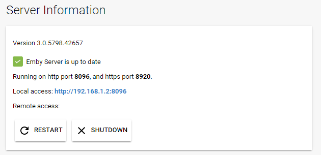
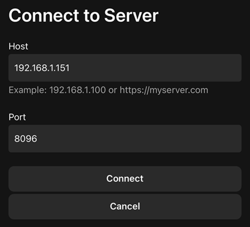
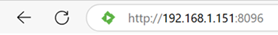

This purpose of this document is to discuss how to connect to Emby Server from additional devices, both within your home network and external. To learn how to grant users access to your server, see [Users](Users).

In most cases you won't need to do anything to connect to your server from other devices, as Emby apps are built to automatically know how to connect to it. But on some systems some manual configuration might be necessary. This document is primarily designed as for troubleshooting when the automatic features do not work.

# In-Network Connections

Most Emby apps can automatically discover your Emby Server on your home network, so in those cases, there's nothing more you need to do. But in the event this does not work, you can still connect to your Emby Server by manually entering the server's address.

To locate your server's internal address, simply open the Emby Server Dashboard on the Emby Server machine, typically http://localhost:8096

Your Emby Server's local address is then displayed in the **Local address** field.

This information can then be entered into Emby apps:

# Troubleshooting Internal Connections

If the above still does not work, please ensure the machine running Emby Server is turned on, and that the Emby Server application is running.

A useful test is to try to use a web browser on another device, such as another computer, smartphone or tablet. You'll need to ensure the other device is connected to the same WIFI network. Try opening a web browser on that device and entering the local address manually:

If this still does not work, then most likely the firewall on the server machine is not allowing access. Below are a list of troubleshooting steps that can be taken to resolve this.

### Open TCP Port 8096 on your server's firewall

If running Windows, most likely you'll need to configure Windows Firewall. See [How to open a port in Windows Firewall](http://wiki.mcneel.com/zoo/window7firewall). 

**Important**: Please do not attempt to skip this step by disabling Windows Firewall, as this usually does more harm than good.

If you're using third party firewall software, you'll need to follow it's instructions to open the port. **Note**: If you're using third party antivirus software such as Norton Internet Security, it will most likely have it's own firewall that will need to be configured.

### Run an AntiVirus Scan

If you're certain you've opened the port and are still unable to connect, the next step will be to ensure the server machine is free of viruses and malware. See [AntiVirus software](https://en.wikipedia.org/wiki/Antivirus_software).

# External Connections

Emby Server also allows you to connect when away from home. We call these external connections because they're out of our home network. Before we begin, we'll assume everything covered above in the **In-Network Connections** section is functioning correctly with your Emby Server, and that you're able to connect using other devices in your home network. If not, then you'll want to go over that section first.

From here, we suggest using the [Emby Connect](Emby-Connect) feature as it takes the guesswork out of external connectivity. You only need to read below if you're not using Emby Connect, or you're having trouble connecting.

### Locate Your External Address

Your external address is displayed on the front page of the server dashboard, labeled as **Remote access**. This is the address you should use when away from home.

### Test Your External Address

The easiest way to test your external address, is to open it in a web browser while away from home, or inside your home using a smart phone or tablet with the wifi connection turned off.

**Important**: Testing your external address inside your home might not work, and this is OK. Some internet routers disable loopback capabilities (going out and coming back in), therefore you might not be able to test this from inside your home network. It's important that you test away from home, or with your smart phone or tablet's wifi connection turned off.

If the external address works in a browser, then you're good to go, and can proceed with connecting from Emby apps.

### Setup Port Forwarding

If you're still unable to connect after testing the above, then you may need to setup port forwarding with your router to allow external connectivity to your Emby Server.

To do this, you'll need to open the web interface for your router, and forward TCP Port 8096 on your router to port 8096 on the Emby Server machine.

The process of doing this will be slightly different for each router model.  Here is a good step by step guide on how to do this:

http://www.wikihow.com/Set-Up-Port-Forwarding-on-a-Router

This Youtube video also explains it pretty well:

https://www.youtube.com/watch?v=Kp-R-eHiQco

### Verify Public Port

To test that your public port is accessible over the internet, try testing it from [canyouseeme.org](http://www.canyouseeme.org/)

If this test does not succeed, then it's an indication that your router is blocking the traffic and may need additional configuration.