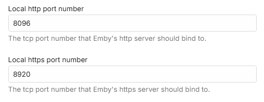

The purpose of this document is to discuss how to connect to the Emby Server from additional devices, both within your home network and externally. To learn how to grant users access to your server, see [Users](Users.md).

In most cases you won't need to do any extra configuration to connect to your server from other devices, as Emby apps are built to automatically know how to connect to it. But on some systems or if you have more than one emby server with remote access enabled, some manual configuration may be necessary.

This document is primarily designed for troubleshooting, when the automatic features do not work and a custom configuration is needed.

# In-Network Connections

Most Emby apps can automatically discover your Emby Server on your home network, so in those cases, there's nothing more you need to do. But in the event this does not work, you can still connect to your Emby Server by manually entering the server's address.

To locate your server's internal address, simply open the Emby Server Dashboard on the Emby Server machine, typically through http://localhost:8096 and clicking on the **Manage Emby Server** cogwheel icon in the top right corner.

Your Emby Server's local address is then displayed in the **In-Home (LAN) access** field in the Dashboard view.

This information can then be entered into Emby apps when making a manual connection through the **Add Server** option:

It is recommended that the local IP Address for the Emby Server machine should be fixed. Use the router's DHCP Reservation feature to do that.
Here is a general guide for doing this. 
https://portforward.com/dhcp-reservation/#how-to-make-a-dhcp-reservation-in-your-router

# Troubleshooting Internal Connections

If the above still does not work, please ensure the machine running Emby Server is turned on, and that the Emby Server application is running. Check through **Task Manager** on Windows, **Activity Monitor** on MacOS, or **ps -e** command on Linux.

A useful test is to try to use a web browser on another device, such as another computer, smartphone or tablet. You'll need to ensure the other device is connected to the same WIFI network. Try opening a web browser on that device and entering the local address manually:

If this still does not work, then most likely the firewall on the server machine is not allowing access. Below are a list of troubleshooting steps that can be taken to resolve this.

### Open TCP Ports 8096 / 8920 & UDP Port 7359 on your server's firewall

If running Windows, the built-in Windows Firewall is usually auto-configured by Emby Server. You may validate this by inspecting the Windows Firewall rules and checking to see Inbound Rules for the EmbyServer.exe for both tcp and udp and Inbound Rules for local TCP ports 8096 and 8920 and for server discovery on the local network, UDP port 7359.

The port rule names are being changed and you may see them as:

and for the program rules:

To configure the windows firewall, see [How to open a port in Windows Firewall](http://wiki.mcneel.com/zoo/window7firewall) which goes through an example of how allow a specific port through the firewall. Enter port 8096 instead of the port shown in this example. If you have secure connections enabled, do the same for tcp port 8920. And add a rule for UDP port 7359 - this is used for server discovery by client apps.

> [!Important]
> Please do not attempt to skip this step by disabling Windows Firewall, as this usually does more harm than good.

If you're using third party firewall software, you'll need to follow it's instructions to open the port.

> [!Note]
> If you're using third party antivirus software such as Norton Internet Security, it will most likely have it's own firewall that will need to be configured.

### Run an AntiVirus Scan

If you're certain you've opened the port and are still unable to connect, the next step will be to ensure the server machine is free of viruses and malware. See [AntiVirus software](https://en.wikipedia.org/wiki/Antivirus_software).

### Check "LAN Networks" server Network setting

If the **LAN Networks** setting is filled in with a value, make sure that the local network is included. If the field is empty and you are using only one network subnet, then this is not relevant to the problem. If you have more than one local network subnets, include all the subnets in the LAN Networks field.

### Use of VPN
When using a vpn on your router, the requests coming into the server from within the local network may not appear as local. You would need to add the local network subnet used by the vpn to the **LAN Networks** server Network setting. Ensure you also include the local network subnet that the server is connected to as well.

As an example, if your local network is on subnet 192.168.1.xxx and the vpn is using subnet 10.253.0.xx, then you would enter: 10.253.0.0/24,192.168.1.0/24 in the LAN Networks server Network settings covering IP address ranges 10.253.0.1 to 10.253.0.255 and 192.168.1.1 to 192.168.1.255. See [LAN Networks](Hosting-Settings.md#LAN-Networks).

### CORS Mixed Content Block
When using the hosted Emby Web app at **app.emby.media**, access to the Emby Server may be blocked when https secure connections is not enabled on the server and the access in the internet browser is through https://app.emby.media. It gets blocked by the browsers because mixed mode of https and http is not permitted. Entering the http url in the browser http://app.emby.media would get round this problem.

You can establish if this is due to the CORS mixed mode error, by opening the browser Dev Console (through the F12 key) and checking the console for errors. You would see an error like this

# External Connections

Emby Server also allows you to connect when away from home. We call these external connections because they're out of our home network. Before we begin, we'll assume everything covered above in the **In-Network Connections** section is functioning correctly with your Emby Server, and that you're able to connect using other devices in your home network. If not, then you'll want to go over that section first.

### Turn on Remote Access

The first step is to ensure remote access is enabled. You do this from the Server's Network menu by enabling "Allow remote connections to this Emby Server".

> [!NOTE]
> Once you have remote access working, if you wish to allow users to connect remotely, you will need to also enable the option for the user accounts - see [Users](Users.md).

On the same page down below this section, you will see this option:

If you have a router that supports UPnP and have this turned on, you can enable the "Enable automatic port mapping" feature. If you do not see this option, please install the Port Mapper Plugin from the plugin catalog.

> [!NOTE]
> Most routers have the UPnP option turned off by default.

If you turn on automatic port mapping in Emby Server (option shown above) and enable UPnP on your router, you likely are done and Emby will work remotely!

> [!NOTE]
> If you just enabled UPnP on your router, please restart the Emby Server.

### Automatic Port Mapping

When **"Enable automatic port mapping"** is enabled, Emby Server will initiate a port mapping request to the router for the http port, and if secure connections are enabled, to also do it for the https public port, to forward to the local ports. Automatic port mapping requires uPnP to be enabled in the router, as mentioned earlier. 

The public ports are by default set to:

You may wish to change the public port numbers for added security.

The following shows the local ports for the server. It is recommended that these local port numbers are left as per the default:

There are tools available to show you what ports are mapped in the router through uPnP. These are useful, because not all routers give details of what dynamic port mapping through uPnP is active. One such tool is [uPnp Wizard](https://www.xldevelopment.net/upnpwiz.php).

If automatic port mapping does not work, you should disable the setting and switch to setting up port forwarding manually on the router.

> [!NOTE]
> If you have more than one router, you will need to do the port mapping manually. See the next section.

### Setup Port Forwarding

If you're unable to connect after testing the above settings with automatic port mapping, then you may need to setup port forwarding manually in your router to allow external connectivity to your Emby Server.

To do this, turn off the "Enable automatic port forwarding" option just set and open the web interface for your router. If using the default public port numbers, you will need to setup a port forward rule for TCP Port 8096 on your router to port 8096 on the Emby Server machine. Do the same for port 8920 as well (if using SSL/secure connections). If you have chosen different public port numbers, then it would be these that need to be specified in the port forward rules.

It is important that the local IP Address for the Emby Server machine does not change. Use the router's DHCP Reservation feature to do that. A good general guide can be found [here](https://portforward.com/dhcp-reservation/#how-to-make-a-dhcp-reservation-in-your-router).

The process of doing a port forward will be slightly different for each router model.

- Here are good step by step general guides on how to do this:

  https://portforward.com/dhcp-reservation/#how-to-make-a-dhcp-reservation-in-your-router

  http://www.wikihow.com/Set-Up-Port-Forwarding-on-a-Router

- This Youtube video also explains Port Forwarding pretty well:

  https://www.youtube.com/watch?v=Kp-R-eHiQco

If you want to use different public port numbers, enter the required public ports in the server [Network Settings](Hosting-Settings.md) fields.

Here is an example router setup showing 2 tcp ports forwarded - using the default public port numbers:

You will find different names for the ports on different routers when setting up the rules. e.g. The public ports may show on the router as WAN Port, or Public Port, or External Port. The local ports may show as LAN Port, or Local Port, or Internal Port or Private Port.

Note that the Source IP / Remote IP should always be blank in a port forward rule.

The server IP Address, to which the port forwards are routed to, may show on the router port forward setup page as host computer, Local IP Address, or Internal IP Address, or Private IP Address.

### Multiple Emby Servers on the network

If you have more than one emby server on the local network, then you will need to make sure they use different public port numbers as they would be routing through the same public IP address. 

The default public / WAN ports are as follows:

Set a different http and https port (where applicable) for each of the servers. If your first server used 8096 and 8920, then you only need to change the public ports for the other server(s) to use different port numbers.

### Multiple Routers

If you have more than one router, eg an ISP provided router and also your own router, then that would lead to a **Double NAT** which would lead to failure to reach the server externally.

In such cases, to get round the problem, it is recommended that one router, e.g. the ISP router, is configured to run in Modem/Bridge mode leaving the other router to do the routing and any port forwarding.

If both need to be running as routers, the configuration would be more complex, needing to cascade the port forward for the public port from the first router to the second, with the first router acting as a pass-through, and to have the actual required port forward to be setup on the 2nd router. Also the 2nd router would need to have its local IP Address as a DHCP reservation on the first router.

### Locate Your External Address & Public Port

You will need to find out what your external IP address is, when troubleshooting remote connectivity issues or to add a manual connection to the server from a remote emby client. When remote connections are enabled, your external address is displayed on the front page of the server dashboard, labeled as **Remote (WAN) access**. The public port is also shown. This is the address you should use when away from home together with the public port number.

### Verify Your External IP Address

Open a browser and visit [canyouseeme.org](http://www.canyouseeme.org). 

The IP you see listed here must match what Emby shows on the dashboard.  If it doesn't, remote access will not work and likely your ISP is using cgNAT or you are using a VPN.

If the IP address matches, then you can proceed to test the connection through the public port. If your external IP addresses changes frequently, consider using a DDNS setup (Dynamic DNS).

### Verify Public IP and Port

Again, you can use [canyouseeme.org](http://www.canyouseeme.org) in a browser and enter each of the public ports that have been configured.

You can also test your external address and public port by opening a web browser while away from home, or inside your home using a smart phone or tablet with the wifi connection turned off.

> [!IMPORTANT]
> Testing your external address inside your home might not work, and this is OK. Some internet routers disable loopback capabilities (going out and coming back in), therefore you might not be able to test this from inside your home network. It's important that you test away from home, or with your smart phone's or tablet's wifi connection turned off.

If these succeed, your Emby Server should be working remotely and can proceed with connecting from Emby apps. But, if you find that even with this being successful, a device is still failing to connect remotely, check that you have allowed remote connections for the user account that is making the attempt. Refer to [Users](Users.md) Settings and check that in the user settings, **"Allow remote connections to this Emby Server"** is ticked for that user account.

If you continue to fail to connect remotely, you should re-check the setup mentioned above and you will need to do some further troubleshooting. See below for a checklist of the troubleshooting areas.  Please visit our forums for assistance, if you continue to have an issue with this.

# Troubleshooting External Connections

### VPN
If you have a VPN running on the host computer, TURN THIS OFF as that may interfere with your Emby Server routing.

### Anti-Malware and Firewalls
If this is not the case, try temporarily disabling (turn off) any local malware & firewall software running on the same host, to see if they may be blocking Emby. If this was the cause, then you will need to look into the Firewall / Security software to configure it so that the Emby Server application is allowed to accept external connections into the local http and https tcp port for the server

### Local IP Address change
If you are using a manual port forward setup and the local IP Address changes, then the existing port forwards will no longer route to the server. Look into fixing the local IP Address using static IP address or preferably a DHCP Reservation in the router, or both. Make sure any port forwards are updated to the new local IP address. 

See https://portforward.com/dhcp-reservation/#how-to-make-a-dhcp-reservation-in-your-router

### cgNAT Double NAT
You could also be having a Double NAT setup through your ISP giving you a cgNAT (carrier grade Network Address Translation) public IP address. 

To check if you have been given a cgNAT public IP Address, see if it is within this IP range

**100.64.0.0 - 100.127.255.255**

If it is the case, you would need to ask your ISP to give you a static public IP address outside this range. ISPs normally have a monthly fee for this.

### External Public IP Address change
If your external WAN/Public IP address changes, you may find that emby clients fail to connect to the server, especially if the server connection details were added manually on the client app **Add Server** screen. In such case, you will need to delete the server details on the client - on the **Select Server** screen and add it again with the new connection details.

You can mitigate the impact of changes to the external IP address by exploring the use of a **DDNS** (Dynamic DNS service) configuration. Alternatively you can request a static Public IP Address from your ISP. There would normally be a charge for that. You can also look into using **Emby Connect** to link the local emby user account to your Emby Connect email address and use Emby Connect login within the app to connect to the server. See section on **Emby Connect** below.

### Multiple Routers Double NAT

If you have 2 routers, eg an ISP provided router and your own router, there will be a double NAT and port mappings will not work. A Double NAT can be confirmed by checking the Public IP address displayed by https://whatismyipaddress.com/ or https://canyouseeme.org and comparing it to the WAN IP address displayed within the router configuration dashboard, the router to which the emby server machine is connected. If the addresses do not match, then most likely you have a Double NAT.

To get round this, the options that you have are:
1. Have one of the routers operate in Modem/Bridge mode, e.g. the ISP router. The other router would become the active router and handle the port forwards and port mapping. Consult the router manual for how to switch to Modem/Bridge mode.
2. Have one of the routers operate as an Access Point, eg the ISP router becomes the router and your own router configured as an Access Point.
3. Use both as routers but cascade the port forwards through the first router - acting as a Pass-Through. In this scenario, port mapping must be manual with manual port forward setup on both routers. As an example, if your server public http port is 32700 and https is enabled and is using public port 32800, you would do the following:
- Have the local IP address of the 2nd router as a DHCP reservation in the first router - so it remains fixed. You would need to find the Mac Hardware address of the WAN Port of the 2nd router and use that to specify a DHCP reservation for it in the first router
- On the first router, setup a tcp port forward for http port 32700 to forward to port 32700 to the local IP address of the second router. And do the same for the https port - forwarding tcp 32800 to port 32800 to the local IP address of the second router.
- On the second router, setup DHCP reservation for the Emby Server local IP address
- On the second router, setup port forwards for the http public tcp port 32700 to forward to port 8096 to the local IP address of the emby server machine. And similarly, if secure connections are used, setup the port forward for the https tcp public port 32800 to forward to port 8920 to the local IP address of the emby server machine.

### Multiple Servers - Public Port clash

If you have more tha one system running emby server on the local network and remote connections enabled, then with the default settings there would be a public port clash and the remote connections would be attempting to go to the first system that was configured. In such cases, you will need to change the public ports and ensure that each emby server has a different public port.

### ISP Blocking
You may also be blocked by your ISP. Open command prompt session and do a trace route to 8.8.8.8.

On windows it would be: `tracert 8.8.8.8`

Ignore the first line which will be your own router.  What you want to see is if any of the next 3 or 4 lines start with 10., 192. or 172.  If the first octet number is a 172 we need to check the second octet number to see if it's between 16 to 31 (172.16.xx.xx to 172.31.xx.xx).  If any of these returned lines matches this you are likely being blocked by your ISP.

# Emby Connect

Regardless of the method used for port forwarding, whether it is automatic using uPnP or a manual configuration of the router, we suggest trying out the Emby Connect feature as it takes the guesswork out of external connectivity. The Emby apps would find the route to the server using Emby Connect.  See [Emby Connect](Emby-Connect.md).
