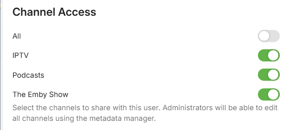

Content access allows you to configure the libraries and channels a user is allowed to access.

To manage content access for a user, navigate to the server dashboard -> **Users** -> **Click User** -> **Access**.

## Library Access

Library access allows you to configure the media libraries a user can access. Where a library has multiple folder paths defined, you can also control access at the folder level. See [Folder Based Access Control](Folder-based-Access-Control.md).

## Channel Access

Channel access allows you to configure the channels a user can access.

