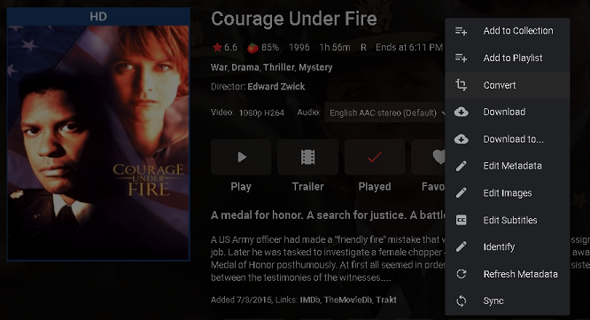

Want to reduce on the fly transcoding? We now have a feature that can help you convert your library into streaming-friendly formats. It's easy, just click on the 3 dot/more menu and select Convert on the popup menu.

 

Then specify the options you want:
                                    Posted Image

 

The media will then be converted and stored in the original media folder with the original item.

### Convert to

Allows for a choice of replacing the current file or creating a new converted copy.

#### Profile

This option allows you to select Mobile, TV or Custom profiles to use. Mobile and TV profiles make the corresponding choices for you but if you select Custom you can choose many of your own options such as the container, video codec, and the audio codec.

#### Quality

The quality drop down box gives you several choices in Megabits per second to choose.

#### Automatic Conversions
Want to convert new content automatically as it gets added to your library? It's simple, just convert a folder such as a TV series, and then enable the option to automatically convert new content.

 

Posted Image

 