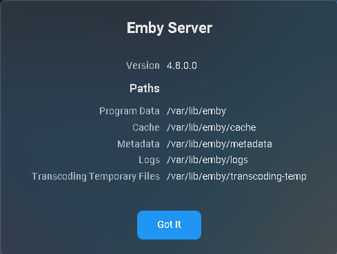

 If your server log file shows SQLite errors like the following example your library.db file needs attention.

`SQLitePCL.pretty.SQLiteException`

### What can cause this to happen

Typical causes of this are sudden and abrupt terminations of the Emby server process, such as a power loss, operating system crash, force killing the server process, etc.

### Find Location of Database Files
This is easily found using the 3 top menu right above the server information box.

     
Click on View Server Info

We need the location of the library database files. They are located in the "data" directory under the first path shown.

`/var/lib/emby/data` is the location to use for each of the solutions below.

## Solutions to Try in This Order

### Remove Database Locks

1. Shutdown Emby

2. Navigate to the folder containing your database file

3. Delete library.db-shm & library.db-wal

4. Restart Emby

Check you server log for SQLite errors and only continue to the next step if needed

### Check Database Integrity and Recover Database

This step will require the use of a SQLite editor which can be downloaded from sqlite.org. If you prefer a graphical based editor you can download DB Browser for SQLite which is available for most platforms.

#### Run Integrity Check

Open the library.db database and run the following SQL command:

`PRAGMA integrity_check`

If using the command line tool try the following

`sqlite3 library.db "PRAGMA integrity_check"`

This should return an integrity_check back of "OK" with no errors reported. If errors are reported we need to recover the database.

#### Recover library.db

What we need to do is dump all data from the database to a text file and then reload this back to another freshly created database. This can be done via a single command using the SQLite command line editor.

1. Run the following command line  
   `sqlite3 library.db ".recover" | sqlite3 library-recovered.db`  
(this may take a while to run so please wait for it to finish)

2. We will now check the integrity of our recovered database (as above) using

    `sqlite3 library-recovered.db "PRAGMA integrity_check"`

This should return an integrity_check back of "OK" with no errors reported. If errors are reported please report this in the forum before proceeding to Reset the Library Database. If OK and no errors are reported continue with step 3.

3. Make a copy of both library.db and library-recovered.db

4. Rename library.db to library.old

5. Rename library-recovered.db to library.db

6. Restart Emby Server

Check you server log for SQLite errors and only continue to the next step if needed

### Steps to Reset Library Database & Load Fresh
1. Shutdown Emby

2. Change to the database location found above containing your database files

3. Rename library.db to library.corrupt

4. Restart Emby

5. Run a Full Library Scan