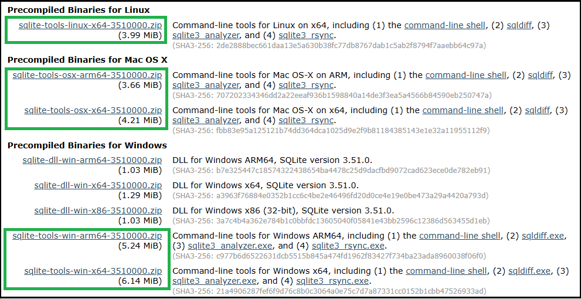

If your server [log file](Log-Files.md) shows SQLite errors like the following example, it is most likely that your library.db file needs attention.

`SQLitePCL.pretty.SQLiteException`

## What can cause this to happen

Typical causes of this are sudden and abrupt terminations of the Emby server process, such as a power loss, operating system crash, force killing the server process, etc. Database errors could also arise if you switch back and forth between Emby Server public release and beta releases.

> [!Important]
> In general, downgrade from beta to an earlier public release is not supported. Databases may be incompatible.

The following logged database error indicates a corrupt database file:

`SQLitePCL.pretty.SQLiteException: Corrupt: database disk image is malformed`

SQLite tools can be used to try and recover from this. Alternatively, an easier option would be to see if you can restore the database from a backup - refer to [Backup & Restore](Backup.md) for details of how to restore the databases from a backup.

> [!TIP]
> You should always check first, if restore from a backup, resolves the issue before attempting database repairs using the SQLite tools.

## Attempt to recover the database

### Identify the corrupt database

Emby Server has 4 databases: `activitylog.db`, `authentication.db`, `library.db` and `users.db`. The main database is the `library.db` which tends to be the one that may end up with a corruption.

There would be clues in the [embyserver log file](Log-Files.md) as to which database is corrupt. The following maps the internal database names to the actual database filenames:

```
SqliteItemRepository			library.db
SqliteUserRepository			users.db
AuthenticationRepository		authentication.db
ActivityRepository			activitylog.db
```
As an example, the following log line within the logged error block indicates that the corrupt database is the `library.db`:

`at Emby.Server.Implementations.Data.SqliteItemRepository.Initialize`

### Find Location of Database Files

If the Emby Server is not launching due to the corruption, please refer to [Server-Data-Folder](Server-Data-Folder.md) for establishing where the Emby Server data is stored. The database files are in the "data" sub-directory below the path shown in the support document.

Alternatively, you can find the path by using the "**...**" top menu right above the server information box in the Emby Server Settings Dashboard. 


Click on **View Server Info**.

The database files are in the "data" sub-directory below the Program data path shown.

You will need to use a command-line window, linux shell window, mac terminal session to run the command line shell for SQLite. For NAS, an ssh connection would be needed to access the database files. For Android, [adb](https://developer.android.com/tools/adb) would be needed.

**The examples below, will all be for the `library.db`.**

### Solutions to Try in This Order

### Remove Database Locks

1. Shutdown Emby Server if it is running and check that the EmbyServer process is no longer showing before proceeding to the next step. Check with Windows **Task Manager**, macOS **Activity Monitor**, **top** or "**ps -aux | grep emby**" on linux and NAS.

2. In a command line window or terminal session on macOS, or shell window on linux and NAS, navigate to the `data` directory containing your database file. The following are a few examples, refer to the [Server Data Folder](Server-Data-Folder.md) document for the complete list.
 
On some NAS systems, you may need to gain root privileges first by executing "**sudo -s**" first.

Examples:

**Windows** 
```
cd "%AppData%\Emby-Server\programdata\data"
```

**Linux** 
```
cd /var/lib/emby/data
```

**macOS**
```
cd ~/.config/emby-server/data
```
or
```
cd ~/emby-server/data
```

**Western Digital NAS**
```
cd /mnt/HD/HD_a2/emby/data
```

**Synology DSM 7 NAS**
```
cd /volume1/@appdata/EmbyServer/data
```

**Synology DSM 6 NAS**
```
cd /volume1/Emby/data
```

**QNAP NAS**
```
cd /share/CACHEDEV1_DATA/.qpkg/EmbyServer/programdata/data
```
or
```
cd /share/HDA_DATA/.qpkg/EmbyServer/programdata/data
```
(see [Server Data Folder](Server-Data-Folder.md) for the paths for other platforms)


3. Delete the `library.db-shm` & `library.db-wal` files if present. You can check if they are present using `dir` on windows or `ls` on other platforms.

**Windows**
```
   del library.db-shm
   del library.db-wal
```
**Other platforms**

You may need to gain root privileges by executing "**sudo -s**" first.
```
   rm library.db-shm
   rm library.db-wal
```

4. Restart Emby Server

Check your [server log](server-logs.md) for SQLite errors and only continue to the next step if needed.


### Check Database Integrity and Recover Database

This step will require the use of the [Command line shell for SQLite3](https://sqlite.org/cli.html) tool, which may be pre-installed on some platforms. It can be downlaoded as part of the Sqlite3 tools from [https://www.sqlite.org/download.html](https://www.sqlite.org/download.html). If you prefer a graphical based editor, you can download [DB Browser for SQLite](https://sqlitebrowser.org/dl/) which is available for most platforms. The instructions given in this document are for the official SQLite3 tools provided by https://sqlite.org.

> [!NOTE]
> On NAS platforms and for Android Emby Server, you may need to copy the database file to a computer and do the integrity check and repair on the computer and then copy the file back. Access to the database on NAS systems will require enabling & using ssh, and [adb](https://developer.android.com/tools/adb) & enabling Developer Options for Android.

The following shows the available sqlite tools binaries for download:



> [!NOTE]
> On some NAS platforms, you may need to gain "root" privileges by executing "sudo -s" first. Alternatively, prefix commands with "sudo". For some platforms, you would be using root and there is no "sudo" command.


#### Run Integrity Check

1. Shutdown Emby Server if it is running and check that the EmbyServer process is no longer showing before proceeding to the next step. Check with Windows **Task Manager**, macOS **Activity Monitor**, **top** or "**ps -aux | grep emby**" on linux.

2. Navigate to the folder containing your database file, see earlier paragraph covering this.

3. If you downloaded the sqlite3 tools rather than using a pre-installed sqlite3 binary, copy the downloaded sqlite3 file (sqlite3.exe or sqlite3) to this directory to make it easier to use. Alternatively, create a temporary folder where you place the database file you are working on and the sqlite3 tool.

> [!Important]
> Check that you are in the right directory, the directory where the database file is, as sqlite3 does not warn you if it it does not find the database and would instead create a new database in the current path.

Open the `library.db` database and run an integrity check on it:

```
sqlite3 library.db
PRAGMA integrity_check;
```

This should return an "ok" when there are no corruptions. If errors are reported, we need to repair the database.

type in `.quit` to exit

Examples of results:

Corruption detected
```
SQLite version 3.50.1 2025-06-06 14:52:32
Enter ".help" for usage hints.
sqlite> PRAGMA integrity_check;
Parse error: database disk image is malformed (11)
sqlite> .quit
```
Successful integrity check
```
SQLite version 3.50.1 2025-06-06 14:52:32
Enter ".help" for usage hints.
sqlite> PRAGMA integrity_check;
ok
sqlite>.quit
```

#### Repairing the database

With Emby Server shutdown, save a copy of the existing database file and then work on the actual database file.

**Windows**
```
copy library.db library-saved.db
```
**Other Platforms**
```
cp library.db library-saved.db
```

Attempt to vacuum and reindex the database to see if that resolves the issue. Switch to the directory holding the database and open it and run the two commands:

```
sqlite3 library.db
VACUUM;
REINDEX;
```
The commands may take a while to complete. You may get errors indicating corruption.

At the end, close the database and exit, with the `.quit` command.

If there were no errors, then you can try to see if the issue is resolved.

Restart Emby Server and check the [emby logs](Log-Files.md) for database errors.

If database errors persist or the `VACUUM` or `REINDEX` failed, then we can try to run the `.recover` SQLite3 command.

Shutdown Emby Server

Navigate to the databases folder as before and open the database file with sqlite3:

```
sqlite3 library.db
.output recovered-librarydb.sql
.recover
```
This may take a while to run. At the end, type `.quit` to close the database file.

The `recovered-librarydb.sql`file will contain the sqlite3 commands to recover the database. The file may be large but it is a text file, and you should be able to view its contents - using text editors that can handle potentially very large files.

We can now create a new database file using this recovery file.

Create a new database file and lets call it `library-recovered.db`. The following creates this new db file:
```
sqlite3 library-recovered.db
.read recovered-librarydb.sql
```
(this may take a while to run, so please wait for it to finish)

Enter `.quit` command to close the database and exit.

We will now check the integrity of our recovered database by running:
```
sqlite3 library-recovered.db
PRAGMA integrity_check;
```
This should return an integrity_check back of "ok" with no errors reported. If errors are returned, please report this in the forum before proceeding to Reset the Library Database. If "ok" and no errors are reported, continue with the next step.

At this point, we have
```
library-saved.db        Original corrupt/suspect database
library.db              Original corrupt/suspect database
library-recovered.db    The new repaired database
```

We will now rename the `library.db` to `library.db.old` and switch the new repaired database to be the `library.db`.

**Windows** 
```
rename library.db library.db.old
rename library-recovered.db library.db
```
**Other platforms**
```
mv library.db library.db.old
mv library-recovered.db library.db
```
If this is for a NAS and is being repaired on a computer, we now need to copy the new repaired library.db to the NAS databases directory.

Similarly, if the repair was done working in a temporary directory, we need now to copy the new repaired library.db to the correct directory overwriting the corrupt/suspect database file.

Ensure the new `library.db` has the same permissions and ownership as the original library. Adjust the permissions and ownership if not. For linux and NAS, the owner, group and permissions can be seen for files in the `data` directory by executing `ls -ail`.

Restart Emby Server

Check you server log for SQLite errors and only continue to the next step if the database still gives errors and the repair has not been successful.


## Steps to Reset Library Database & Start with a Fresh new setup of Emby Server

1. Shutdown Emby Server

2. Navigate to the databases folder as per the earlier instructions 

3. Rename library.db to library.db.corrupt

**Windows**
```
rename library.db library.db.corrupt
```
**Other platforms**
```
mv library.db library.db.corrupt
```

4. Restart Emby Server

5. Recreate your media libraries