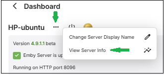

If your server [log file](Log-Files.md) shows SQLite errors like the following example your library.db file needs attention.

`SQLitePCL.pretty.SQLiteException`

## What can cause this to happen

Typical causes of this are sudden and abrupt terminations of the Emby server process, such as a power loss, operating system crash, force killing the server process, etc. Database errors could also arise if you switch back and forth between Emby Server public release and beta releases.

> [!Important]
> Downgrade from beta to an earlier public release is not supported. Databases may be incompatible.

The following logged database error indicates a corrupt database file:

`SQLitePCL.pretty.SQLiteException: Corrupt: database disk image is malformed`

SQLite tools can be used to try and recover from this. Alternatively, see if you can restore the database from a backup - refer to [Backup & Restore](Backup.md). You should always check first, if restore from a backup resolves the issue before attempting database repairs using the SQLite tools.

SQlite3 Tools may need to be downloaded on some platforms. e.g. Windows. On Mac OS, sqlite3 should be pre-installed and available to run in terminal on both intel x64 and arm sytsems. For linux, it would be best to download the latest precompiled Sqlite-Tools binary from the following link [https://www.sqlite.org/download.html](https://www.sqlite.org/download.html).

## Attempt to recover the database

### Identify the corrupt database

Emby Server has 4 databases: `activitylog.db`, `authentication.db`, `library.db` and `users.db`. The main database is the `library.db` which tends to be the one that may end up with a corruption.

There would be clues in the [embyserver log file](Log-Files.md) as to which database is corrupt. The following maps the internal database names to the actual database filenames:

```
SqliteItemRepository			library.db
SqliteUserRepository			users.db
AuthenticationRepository		authentication.db
ActivityRepository			activitylog.db
```
As an example, the following log line within the logged error block indicates that the corrupt database is the `library.db`:

`at Emby.Server.Implementations.Data.SqliteItemRepository.Initialize`

### Find Location of Database Files

This is easily found using the `...` top menu right above the server information box.



Click on `View Server Info`


We need the location of the library database files. The databases are held in the `data` directory under the Programme Data path shown.

e.g. for linux, it would be `/var/lib/emby/data`. This is the path we will use in the examples below. To familiarize yourself with the different locations for the various platforms and possible need to use of ssh, see [Emby Server App Data area](Server-Data-Folder.md).

The examples below, will all be for the `library.db` database on linux. Use similar commands for other platforms.


### Solutions to Try in This Order

If you are running on linux, ensure you have full permissions for all the commands below. You can run with root priviledges by executing:

`sudo -i`

### Remove Database Locks

1. Shutdown Emby

2. Navigate to the folder containing your database file

    eg for the linux example, 

    `cd /var/lib/emby/data`

3. Delete `library.db-shm` & `library.db-wal`

4. Restart Emby

Check your [server log](server-logs.md) for SQLite errors and only continue to the next step if needed.


### Check Database Integrity and Recover Database

This step will require the use of a SQLite3 utility which is part of the Sqlite3 tools download from sqlite.org or pre-installed, e.g. on Mac OS. If you prefer a graphical based editor you can download DB Browser for SQLite which is available for most platforms.

#### Run Integrity Check

Make sure the current directory is where the database is, eg for linux

`cd /var/lib/emby/data`

Open the `library.db` database, e.g.

`sqlite3 library.db`

and run the following SQL command:

`PRAGMA integrity_check;`

This should return an "ok" when there are no corruptions. If errors are reported, we need to repair the database.

type in `.quit` to exit

Examples of results:
```
SQLite version 3.50.1 2025-06-06 14:52:32
Enter ".help" for usage hints.
sqlite> PRAGMA integrity_check;
Parse error: database disk image is malformed (11)
sqlite> .quit
```

```
SQLite version 3.50.1 2025-06-06 14:52:32
Enter ".help" for usage hints.
sqlite> PRAGMA integrity_check;
ok
sqlite>.quit
```

#### Repairing the database

With Emby Server shutdown, save a copy of the existing database file and then work on the actual database file.

`cp library.db library-saved.db`

Attempt to vacuum and reindex the database to see if that resolves the issue. Switch to the directory holding the database and open it:

```
cd /var/lib/emby/data
sqlite3 library.db
```

Then run these two SQLite3 commands. The commands may take a while to complete. You may get errors indicating corruption.

```
VACUUM;
REINDEX;
```
At the end, close the database and exit, with the `.quit` command.

If there were no errors, then you can try to see if the issue is resolved. 

Restart Emby Server and check the [emby logs](Log-Files.md) for database errors.

If database errors persist or the `VACUUM` or `REINDEX` failed, then we can try to run the `.recover` SQLite3 command.

Shutdown Emby Server

Navigate to the databases folder as before and open the database file with sqlite3, e.g.

```
cd /var/lib/emby/data
sqlite3 library.db
```

Run these SQLite3 commands

```
.output recovered-librarydb.sql
.recover
```
This may take a while to run. At the end, type `.quit` to close the database file.

The `recovered-librarydb.sql`file will contain the sqlite3 commands to recover the database. The file may be large but it is a text file, and you should be able to view its contents - using text editors that can handle potentially very large files.

We can now create a new database file using this recovery file.

Create a new database file within the databases directory. Lets call it `library-recovered.db`. The following creates this db file:

`sqlite3 library-recovered.db`

We now need to add the content, so type in this command:

`.read recovered-librarydb.sql`

   (this may take a while to run so please wait for it to finish)

Enter `.quit` command to close the database and exit.

We will now check the integrity of our recovered database (as above) using

`sqlite3 library-recovered.db`

and entering sqlite3 command:

`PRAGMA integrity_check;`

This should return an integrity_check back of "ok" with no errors reported. If errors are reported please report this in the forum before proceeding to Reset the Library Database. If "ok" and no errors are reported, continue with the next step.

Make a copy of both library.db and library-recovered.db

Rename library.db to library.old

Rename library-recovered.db to library.db

Ensure the new library.db has the same permissions and ownership as the original library- which we saved to library.old. Adjust the permissions and ownership if not.

Restart Emby Server

Check you server log for SQLite errors and only continue to the next step if needed

### Steps to Reset Library Database & Start with a Fresh new setup

1. Shutdown Emby

2. Change to the database location found above containing your database files

3. Rename library.db to library.corrupt

4. Restart Emby

5. Recreate your media libraries