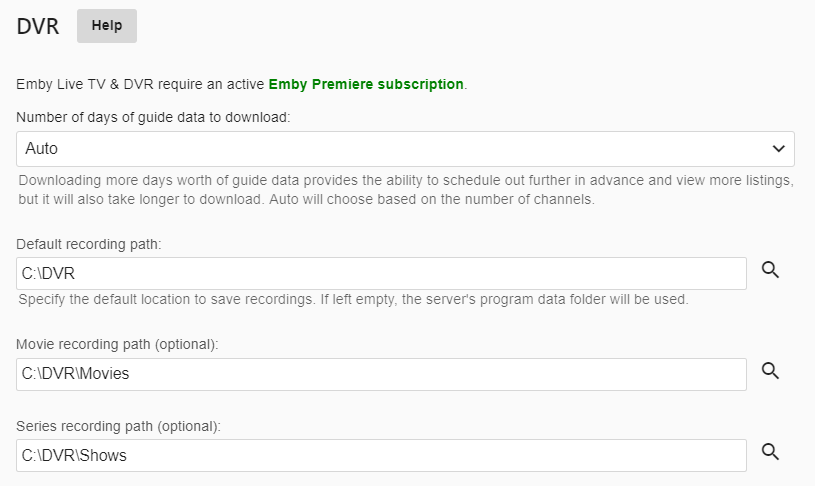
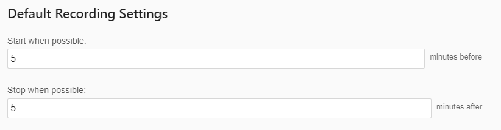
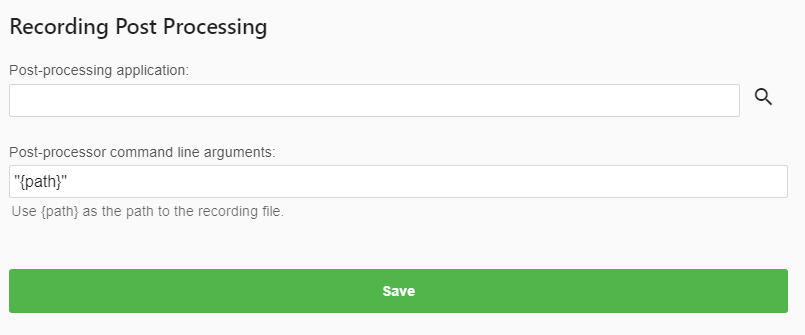

To set the optional DVR settings, click DVR in the administrator dashboard under the Live TV Menu.

These options should be self explanatory.  The first option allows you to set the amount Guide Data that is loaded.  You can manually set this from 1 to 14 days or leave it set to Auto. When you leave it set to Auto, Emby will choose the amount of days loaded based on how many channels you have defined to balance performance with the convenience of having as much guide data as possible.

The next three options allow you to set the default recording path used.  It also allows you to set a specific parent folder where all Movies and all TV Shows are saved to.

These 3 options are blank by default and the example above shows custom settings.

You can set custom start and end times to pad your recordings.  These are blank by default but in this example both were set to 5 minutes.

With the above settings in place all recordings schedule will have a default start time of 5 minutes before the scheduled time and will end 5 minutes after the scheduled end time.

When individual events are schedule to record by a user in any Emby Application these settings will be the default used.  This can be overwrode for each individual recording if needed.  For example people recording sporting events will often change the end time to 30 or 60 minutes to make any overtime play is taken into consideration.

These next two sections are advanced functionality that won’t be covered here. This is for people who create scripts or programs that manipulate recordings after they finish.  This post processing can be used for many different things including commercial cutting, converting files to specific formats, moving files to other parts of the system.

You can find samples of scripts in the Emby forums shared by users and get help setting these up as well.

If you’ve made any chances on the DVR Settings page click the Save button to finish.

