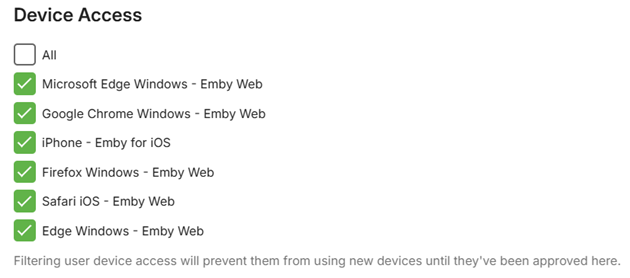

Device access allows you to configure the devices a user is allowed to sign in from. By default, users can use any device.

To manage device access for a user, navigate to the server dashboard -> **Users** -> **Click User** -> **Access**. 

**Important notes about device control**: Filtering devices for a user will prevent them from being able to sign-in with a new device until it is enabled from this page.
