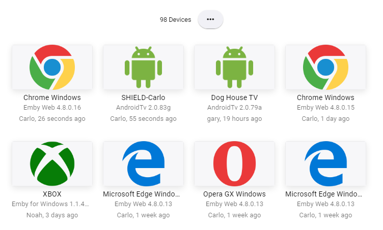
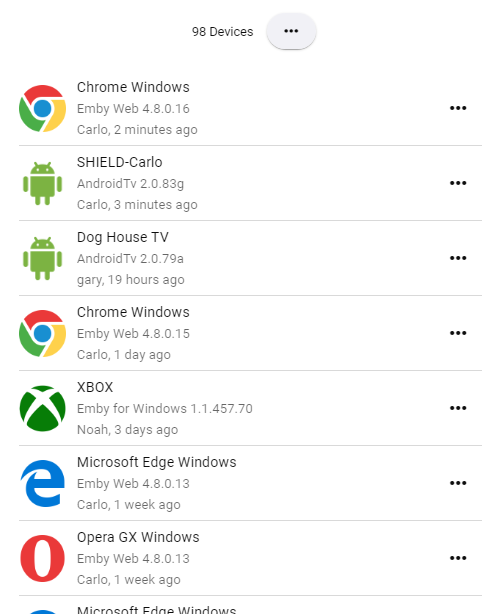
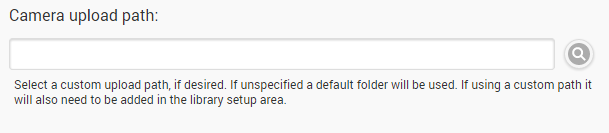

The devices section displays all devices that have connected to your server, both active and inactive. It allows you to customize various device settings such as the display name.

Devices are accessed from the server dashboard by navigating to **Devices**. A list of devices will be displayed, for example: 

## Removing a device

To remove a device from the list, click the minus button on the right-hand side. Please note that the device will re-appear the next time it connects. Removing a device is useful when you know it will no longer be used with your server.

## Device Settings

Click into a device in order to customize it's options. 

The display name can be changed in order to personalize how it will appear in your Emby apps. The original name reported by the device is displayed above in a read-only fashion.

If the device supports camera upload, you can also customize the path in which images are uploaded for that device:

**Note**: When using a custom upload path, you will need to add that path to the server library.

For more information, please see [camera upload](Camera-upload).

