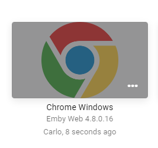
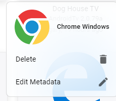
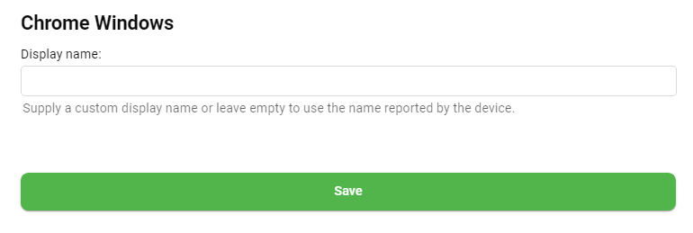

The devices section displays all devices that have connected to your server, both active and inactive. It also allows you to customize the display name.

Devices are accessed from the server dashboard by navigating to **Devices**. A list of devices will be displayed, for example: 

Or by clicking the 3 dot menu you can change the view to "list" for this:

## Removing a device

To remove a device from the list, hover over the image to get the three dot menu. In list view the 3 dots are on the right.

Click the 3 dot menu for a popup that looks like this:

From here you can delete the device or edit the display name.

