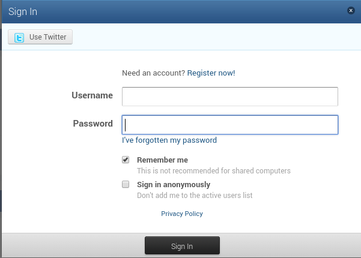
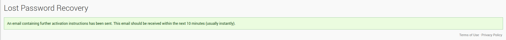

## What does Emby Connect do?

Emby Connect is a free optional service that allows a person to use one set of username/password credentials when accessing Emby's Forums and Community as well as any Emby Server's setup for you to login using Emby Connect.

#### Does This Mean My Streaming is Passing Through the Cloud?

No, all connections are direct from your devices to your Emby Server. The sole purpose of the Emby Connect feature is to help your devices locate your Emby Server so that you don't have to set it up yourself.

## User Guide

Start by signing up for Emby Connect. Once you have your Emby Connect account it can be given to any Emby admin who will add it to your account on their system.

Click on the SIGN UP button to continue.

Fill out this page with user's proper information and click the CREATE MY ACCOUNT button. Follow any directions you might receive in email.

## Changing your Emby Connect password

Changing your Emby Connect password is done here: https://emby.media/community/

Click on your username, top right of the screen, then click on My Profile.

Next, click on Edit Profile.

You will then be presented with a form to complete, with your current password and your new password (twice).

If you are unable to login to the Emby Community, you can try resetting your password here.

## Password Reset

If you have forgotten your Emby Community password, you can reset it.

From the sign-in page, click on "I've forgotten my password".

You will then be presented with a form where you can request a password reset.

Enter either your Emby Community username, or the email address you signed-up with.

Click on the "I'm not a robot" and then click PROCEED.

You will then see confirmation message that a email has been sent to the address entered, or associated with the username entered.

Once the email is received (make sure to check your SPAM folder), simply following the instructions contained within it.

### Guide for Administrators

Please see [Emby Connect](Emby-Connect.md)

