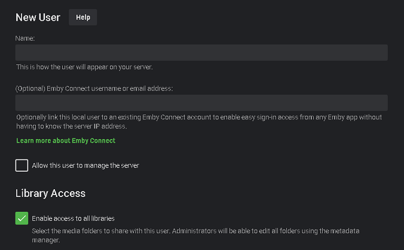

## What does Emby Connect do?

Emby Connect is a free optional service that allows a person to use one set of username/password credentials when accessing Emby's Forums and Community as well as any Emby Server's setup for you to login using Emby Connect.

The user no longer needs to remember the URL or IP/port of each Emby Server, not do they have to remember different login names and passwords as set on the different Emby Servers.

#### Example
You have 2 brothers and 3 cousins running Emby Servers. You have been given access to each server by your family members running the servers. You might have different usernames on each system, IE "bob", "sbob", "bobs", "cousin-bob", "lil-bro", etc. With Emby Connect you no longer need to remember the login credentials or addresses of each server as you can login via Emby Connect with a central username/password. 

## Guide for Administrators

You can optionally use Emby Connect for any user that requests it. Have them give you their Emby Connect username which you add to their account on your system and your job is done.
  Your Emby Server needs to be setup and tested to allow Internet access to your server. 
 If this hasn't been done follow the KB article to get remote access working before using Emby Connect  Remote Setup

Once you have remote access working you can create an account on your system for any users. By default, they will log directly into your server using the username and password you created during their account creation. If a user gives you their Emby Connect username, you simply edit their account on your server filling in the second option shown below.

The user can now login directly with the local credentials on the server or can login via Emby Connect.

From the Server Admin Console click on USERS menu.

## Guide for Users

Please see [Emby Connect For Users](Emby-Connect-for-Users.md)

### Does This Mean My Streaming is Passing Through the Cloud?

No, all connections are direct from your devices to your Emby Server. The sole purpose of the Emby Connect feature is to help your devices locate your Emby Server so that you don't have to set it up yourself.