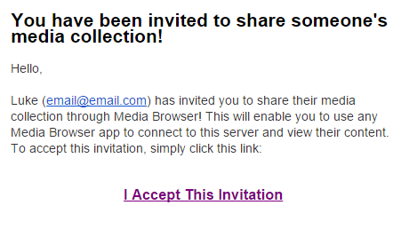
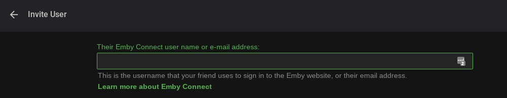
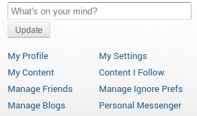
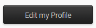
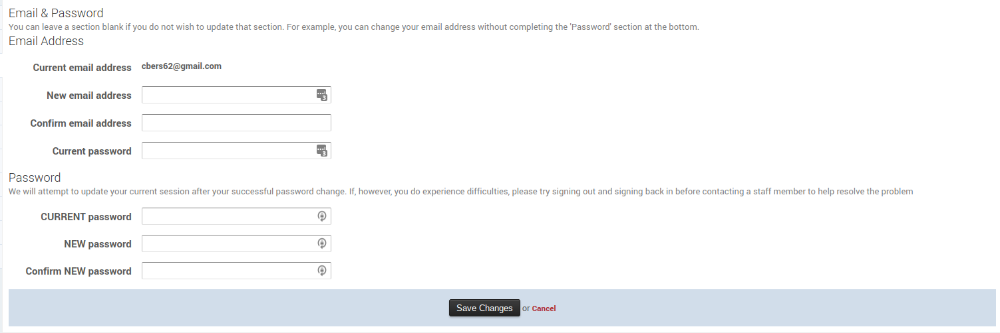

Emby Connect is a free service that makes it easy to sign into your apps when away from home, and manage connections to multiple servers.

Normally signing into a server requires three pieces of information - the server ip address, along with a username and password. With Emby Connect you no longer need to know a server's ip address in order to connect.

## Guide for Users

Start by [signing up for Emby Connect](http://emby.media/connect/). Then ask the owner of an Emby Server to invite you to use their server.

Once the invitation has been sent, you'll need to accept it by clicking on a link in the invitation email. The invitation will appear similar to the following:

Once the invitation is accepted, you're ready to start using their server. [Download any Emby app](http://emby.media/download) and sign in using your Emby username or email address. Or try the [online web app](http://app.emby.media), which doesn't require any installation.

## Server Not Listed?

If your server isn't listed when you sign in with Connect, then it means you haven't yet linked your server to Emby Connect. See the below guide for administrators for details.

## Guide for Administrators

If you're the administrator of an Emby server, the Connect feature makes it easier than ever to invite your family and friends to share your media.

The first step to setting up your server with Emby Connect is to link your server account to your Emby account. This is done in four easy steps:

1. Start by [signing up for Emby Connect](http://emby.media/connect/)
2. Then open your server dashboard, navigate to **Users**, and click on your user account. In the Emby username/email field, enter the email address you used to sign up with Emby Connect, and then click Save.
3. An email will be sent to your address with instructions on how to confirm the account link. Simply click the confirm link within the email.
4. You're now ready to use Emby Connect with your apps. You can easily test this using the [online web app](http://app.emby.media).

### Sending an Invitation

Inviting a friend is easy. Open the Emby server dashboard and navigate to Users. Then click the + button and select "Invite with Emby Connect".

You'll be prompted to enter their Emby username or email address. 

If they don't have one yet that's OK, simply enter their email address and they'll be sent an invitation to signup.

Further instructions are available [here](Users#adding-a-user).

## Changing your Emby Connect password

Changing your Emby Connect password is done via your account on the Emby Community.

From within the Emby Community, click on your username in the top right of the screen, then click on My Profile.

Next, click on Edit Profile.

You will then be presented with a form to complete, with your current password and your new password (twice).

If you are unable to login to the Emby Community, you can try resetting your password [here](Password-Reset).

## Does This Mean My Streaming is Passing Through the Cloud?

No, all connections are direct from your devices to your Emby Server. The sole purpose of the Emby Connect feature is to help your devices locate your Emby Server so that you don't have to set it up yourself.