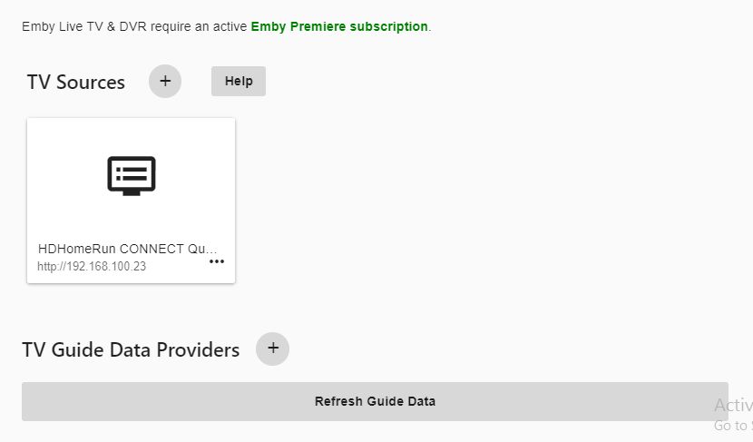

Emby has built in guide data for the United States, Canada and the United Kingdom. If you live in one of these areas then Emby Guide Data should be your first choice of providers to use.  Unlike other guide solutions, everything needed to use is built right into your Emby Server with no 3rd party setup or payments needed.

Emby Guide Data not only includes the basic data provided by other solutions but also has full descriptions of shows,  movies, news and sporting events.  The difference in guide data will be especially noticeable for sports fans! Not only does Emby’s internal solution deliver a rich assortment of information but it also provides posters and artwork delivered from a very fast content delivery network which allows your server to load this data very quickly!

Once you have at least one tuner in Emby, it's time to add your Guide data.

Click the PLUS SIGN next to TV Guide Data Providers.

Select your Country (United State, Canada or United Kingdom)

Select Emby Guide Data as the guide source.

Click Next

Enter our Postal Code.

Select the proper linup from the drop down selection list. In this case we selected our local over the air (OTA) lineup to match our HDHomeRun/antenna setup.

We have selected to enable this guide data for all tuners in the system.

Click Save.

We now see our tuner and our guide data setup. We also see our guide data being loaded by the green progress bar at the bottom.

During part of the this setup, Emby has added a new Scheduled Task to our server which will automatically refresh our guide data every day. This task can be edited like any other task in the system.  We also have the ability to start a manual refresh of guide data by click the Refresh Guide Data button shown in the picture above.
