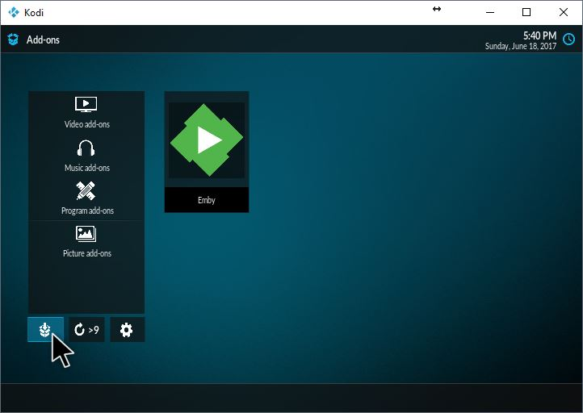

Install the stable or beta repository
You can install our Emby repositories directly from Kodi. It's so convenient! Alternatively, you can grab the repo here, install the repository of your choice in Kodi via install from zip and skip the steps below.

Head over to the file manager. If you can't find the menu item, you can always switch to the estuary temporarily.

The url is http://kodi.emby.media You can name the source as you wish.

The source is now added. Navigate add-ons > box icon with down arrow (at the bottom) > Install from zip.

Select the repository. You are done! You can install both repositories (stable and beta). Remember, if you do, disable add-ons auto-update by opening the side menu and disabling the option. This will give you control when to update your add-ons.

### Final step
You can now install the Emby for Kodi add-on found via installing from repository > Kodi Emby add-ons > video add-ons > Emby. You can also find the latest Emby for Kodi alpha/beta version in the public testing folder, found in the Emby source added earlier (posted above)

### Public testing folder
You can find the public testing folder inside the Emby source you've just added (install from zip). If this is a fresh install, you'll need to install the dependencies first. You can find them within the public testing > dependencies folder. The public testing contains the latest Emby for Kodi beta (sometimes alpha) version. It's useful if you want to upgrade to the latest version available, without installing the Emby beta repository.