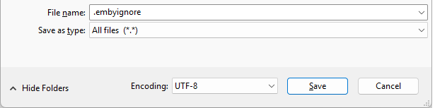
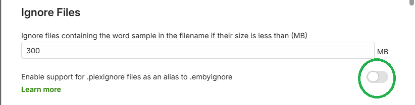
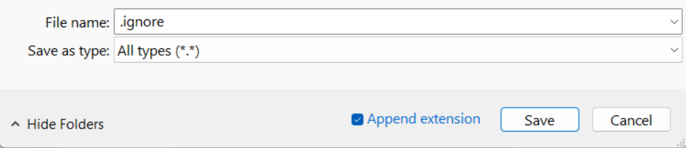

Media files can be excluded during a library scan. This article shows how this can be done and gives details of the feature update that came in Emby Server version 4.9.

## Emby Server 4.9 and later

Media files can be excluded by adding a file named `embyignore` containing the filename(s) path and/or pattern(s) to exclude. This can be added in the root folder of a library or within sub-folders.

On Windows. the .embyignore file can be created using Notepad with the "Save as type" set to "All files (\*.\*)"

 

When adding the `.embyignore` to a root folder of a library, the rules would apply to all folders.

### Contents of the `.embyignore` file

- Comment lines can be added by having a \# character at the beginning of the line.
- Blank lines are ignored.
- Multiple patterns / names / paths can be entered on separate lines.
- A wildcard `*` can be used for file name / folder name pattern.
- Use forward slash character `/` for directory separator - even on Windows.
- When a directory separator is used, the pattern is relative to the directory holding the `.embyignore` file. Otherwise, the pattern may also match any level below the folder holding the `.embyignore` file.
- A leading `/` in a pattern restricts the action to the directory containing the `.embyignore`.

### Examples

- To ignore all `.png` files in a photos library, place an `.embyignore` file containing `*.png` in the root folder(s) of a photos library.
- To ignore all files in a folder, place an `.embyignore` file containing a `*` in the folder that is to be ignored.
- To ignore a folder `private-vids` and all files and folders below it, place an `.embyignore` file containing `private_vids/*` in the root folder of the library.
- To ignore a specific file e.g. `private-video.mp4`, place an `.embyignore` containing `private-video.mp4` in the folder and lower sub-folders.
- To ignore files with names starting with `private` in this folder only, place an `.embyignore` containing `/private*` in the folder.

### Support for .plexignore

For your convenience, Emby Server now also supports `.plexignore`. An option has been added to Library settings for enabling this.

> [!NOTE]
> There may be some differences in outcomes between our support of this feature and Plex. The Emby behavior would not match any that are defects in Plex.

## Emby Server 4.8

To exclude a folder from the library scan, place a file named .ignore inside the folder.

This will cause Emby to ignore all sub-folders as well.

On Windows. the .ignore file can be created using Notepad with the "Save as type" set to "All types (\*.\*)" 

