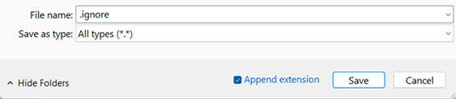

To exclude a folder from the library scan, place a file named .ignore inside the folder.

This will cause Emby to ignore all sub-folders as well.

On Windows. the .ignore file can be created using Notepad with the "Save as type" set to "All types (\*.\*)" 

