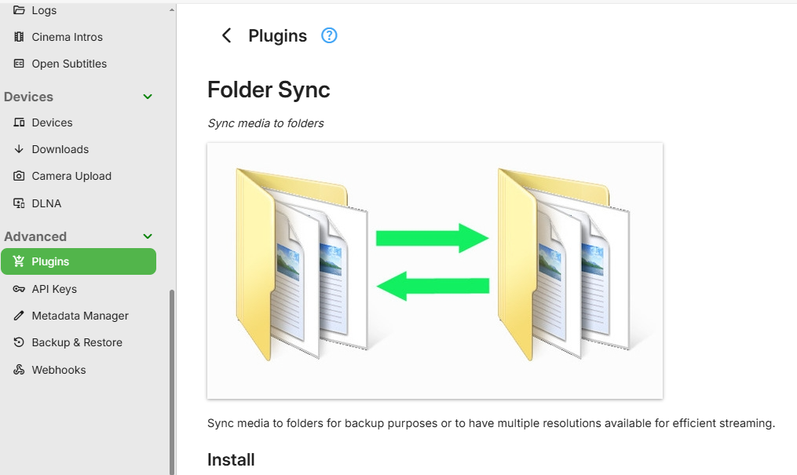
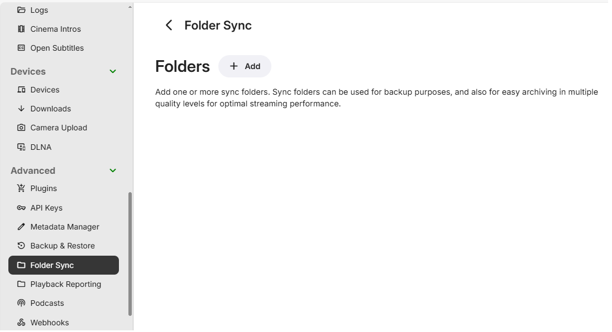
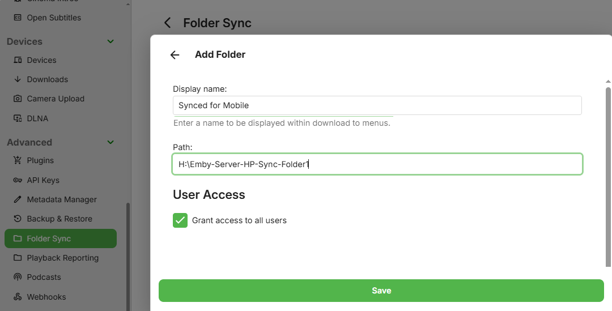

Folder sync allows you to copy content to folders and external hard drives, for backup as well as archiving in multiple resolutions.

When content is archived in multiple resolutions, Emby apps will automatically choose the version that is most efficient for them. This will help relieve stress on your server's CPU.

## Installation

To install folder sync, open the **Emby Server Dashboard** and navigate to **Sync** -> **Services**. 

Click on Folder Sync underneath **Available Services**.

Then proceed to install it on the installation page.

## Add Folders

Once installed, it's time to start adding Folders. These folders are destinations that you'd like to **sync to**, such as an external hard drive or network share.

 

Add a folder by entering the path and giving it a display name. You can also choose whether or not to limit sync access to specific users.

## Ready to Sync

Once a sync folder has been added, it will then show as as an available destination when creating sync jobs:

 

## Playback

Once synced, Emby apps will automatically use the additional media sources when possible. For example, suppose you have a high bitrate movie that requires transcoding to Roku. By syncing to a folder and selecting a conversion profile that is compatible with Roku, the Roku app can then direct stream the synced version rather than transcoding the original.