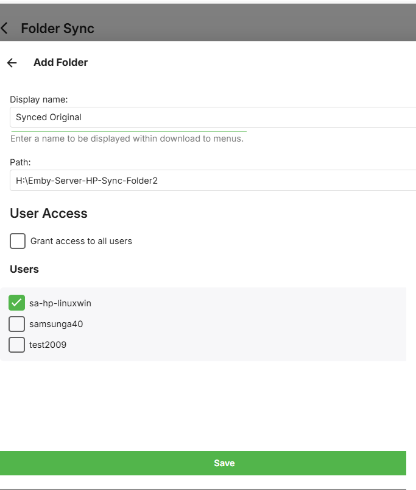
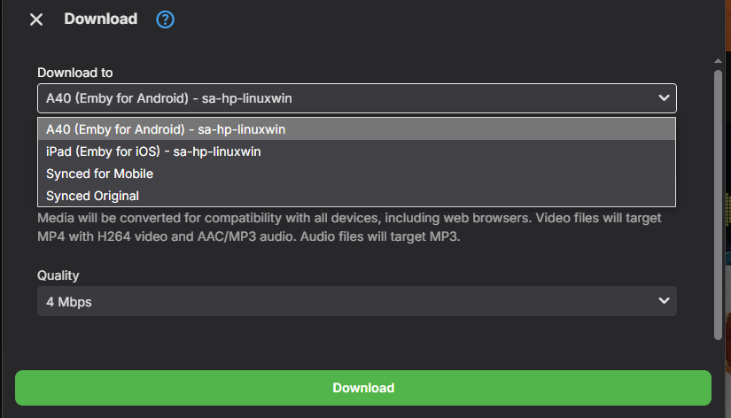
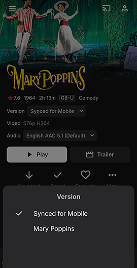

Folder sync allows you to copy content to folders and external hard drives, for backup as well as archiving in multiple resolutions. This is an [Emby Premiere](Emby-Premiere.md) feature.

When content is archived in multiple resolutions, Emby apps will automatically choose the version that is most efficient for them. This will help relieve stress on your server's CPU. The availability of these versions would depend on the permissions granted when setting up Folder Sync.

## Installation

To install Folder Sync, open the **Emby Server Dashboard** and navigate to **Advanced** and click on **Plugins**. Open the **Catalog** and scroll down until you find the **Sync** section. Click on the **Folder Sync** plugin and select **Install**. See [Plugins Overview](Plugins.md).

Restart Emby Server to complete the plugin installation.

## Add Folders

Decide what type of sync folders you will want to have. Examples would be sync folders containing media converted to specific resolution eg 4Mb for streaming to mobile devices or a folder to hold archived copies of the media at original resolution. These destination sync folders can be local disc drives or network shares. The **Download to...** button, available within the media and libraries context menus, becomes the mechanism to create the synced media files in these folder paths. 

Each sync folder path will need to have a name assigned. Choose naming that will make it clear to users what it is. The name will be visible when selecting media for playback and also on the **Download to...** menus for users that have been granted access to create Folder Sync jobs.

Click on **Folders** **+ Add** button

Enter the path and the display name.

Untick the **Grant access to all users** to specify which user account(s) will be allowed to create Folder Sync jobs that will write to this folder.

 

## Ready to Sync

Once a sync folder has been added, it will then show as as an available destination when creating download jobs. The target would only show for users that have been granted access. The following is what server admin user would see on a **Download to...** screen. See [Download Options](Sync.md) for more detail.

 

## Playback

Once synced, Emby apps will automatically use the additional media sources when possible. For example, suppose you have a high bitrate movie that requires transcoding to Roku. By syncing to a folder and selecting a conversion profile that is compatible with Roku, the Roku app can then direct stream the synced version rather than transcoding the original.

In this example, folder sync was used to create mobile 4Mbps versions of some media. They are available as alternative versions in playback and in this example this version was pre-selected automatically.

 

> [!NOTE]
> There is a limit on the number of different versions for a media item. Up to 8 different versions will appear in any list of media item versions.
