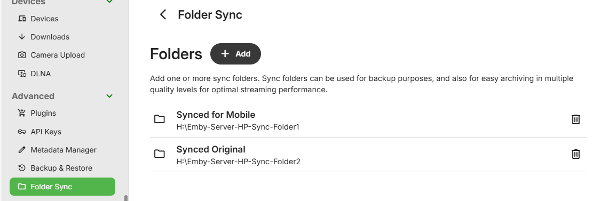

Folder sync allows you to copy content to folders and external hard drives, for backup as well as archiving in multiple resolutions. This is an [Emby Premiere](Emby-Premiere.md) feature.

When content is archived in multiple resolutions, Emby apps will automatically choose the version that is most efficient for them. This will help relieve stress on your server's CPU. The availability of these versions would depend on the permissions granted when setting up Folder Sync.

## Installation

To install Folder Sync, click the **Plugins** menu option on the left from your web Dashboard. Then click the **Catalog** option up top on the right side. Scroll down until you find the **Sync** section. Click on the **Folder Sync** plugin and select **Install**.

## Add Folders

Once installed, it's time to start adding Folders. These folders are destinations that you'd like to sync to, such as an external hard drive or network share. Choose naming that will make it clear to users, as the name is visible in the play version dropdowns. You will be able to sync by using the **Download to...** option on the emby client apps.

Add a folder by entering the path and giving it a display name.

You can also choose whether or not to limit sync folder access to specific users.

 

All Sync folders and paths will show on the Folder Sync plugin setting.

 

## Ready to Sync

Once a sync folder has been added, it will then show as as an available destination when creating download jobs. The target would only show for users that have been granted access. The following is what server admin user would see on a **Download to...** screen. See [Download Options](Sync.md) for more detail.

 

## Playback

Once synced, Emby apps will automatically use the additional media sources when possible. For example, suppose you have a high bitrate movie that requires transcoding to Roku. By syncing to a folder and selecting a conversion profile that is compatible with Roku, the Roku app can then direct stream the synced version rather than transcoding the original.

In this example, folder sync was used to create a mobile 4Mbps versions of some media. They are available as alternative versions in playback and in this example this version was pre-selected automatically.

 
