To install Google Drive, click the Plugins menu option on the left from your web Dashboard.  Then click the Catalog option up top on the right side.  Scroll down until you find.

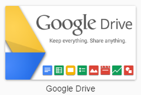

You will be prompted to restart your Emby Server.  Please do this, then after restart navigate back to Plugins and you should see the plugin installed.

Click on the Google Drive image to bring up the popup menu

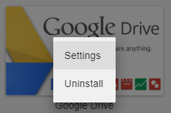

Choose the “Settings” option and you will be in the Google Drive Settings menu

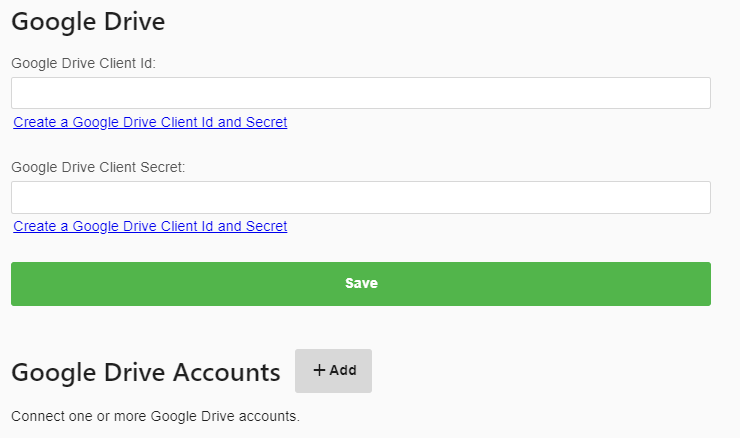

Click the “Create a Google Drive Client Id and Secret” link.  You will then get a screen with instructions

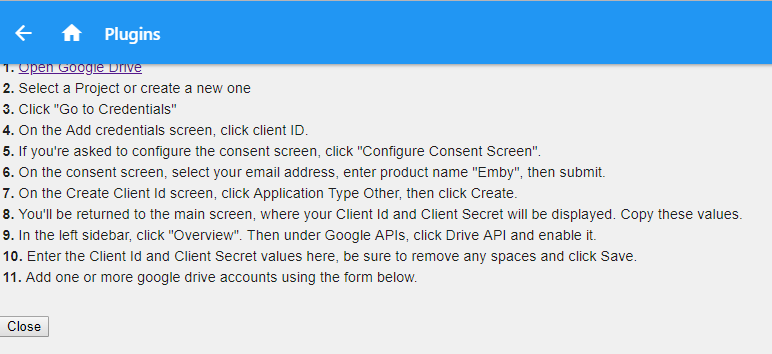

Click the “Open Google Drive” link at the top which will open a NEW TAB.  Refer to the instructions above if needed.

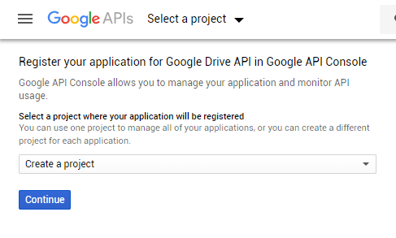

Here we create a new project, select “Create a project” and then click the continue button.

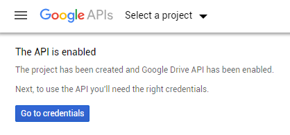

Click the “Go to credentials” button above. You’ll be met with a wizard that trys to determine what type of credentials you’ll need.  Just ignore this and click the “Credentials” menu on the left.

Click the “OAuth consent screen” option in the middle

Type “Emby” for the application name

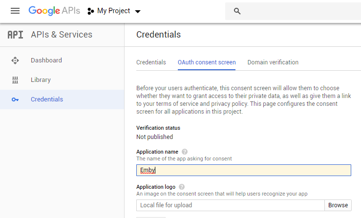

Scroll down to the bottom of the page and click the “Save” button.

You should now be at this screen.

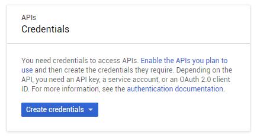

Click the “Create credentials” button

Select the “OAuth client ID” option

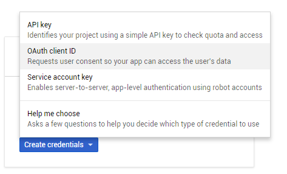

Click “Create credentials

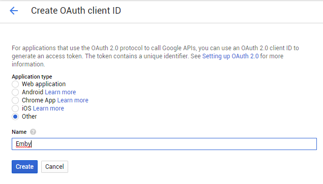

Select applicate type of “Other” and name this “Emby”.  Press the “Create” button.

You should now have your Client ID & client secret codes.

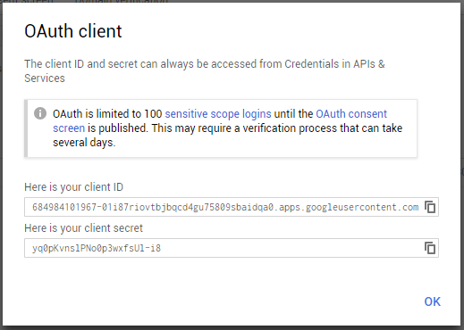

Copy these to notepad or other program for safe keeping.  You will need this again soon.
Now switch back to the Emby tab and click the “Close” button.

You can now paste the client ID and client secret codes into this dialog.

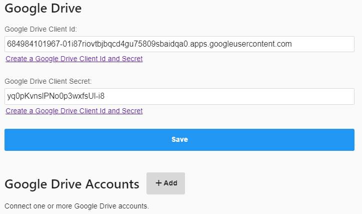

Click the save button to save your Client ID and Client Secret.

Now click the +Add button next to Google Drive Accounts

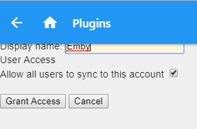

Type in “Emby” as the display name and click the “Grant Access” button.

You may then be prompted with a typical Google Login page.

Select your username and login if needed.  You should then be at this screen.

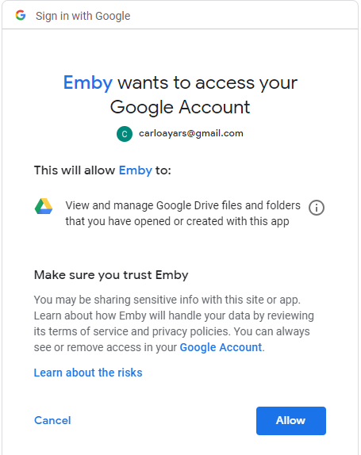

Click the “Allow” button.

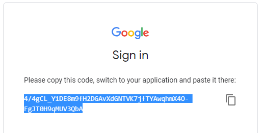

Click the little box to the right to copy this auth code.

Switch tabs back to the Emby tab in your browser.

Paste the code into the code box

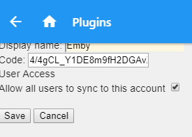

Click the “Save” button.

Congratulations, you have now setup Google Drive to work with Emby Cloud Sync!

## Playback

Once synced, Emby apps will automatically use the additional media sources when possible. For example, suppose you have a high bitrate movie that requires transcoding to Roku. By syncing to the cloud and selecting a conversion profile that is compatible with Roku, the Roku app can then direct play the synced version rather than transcoding the original.