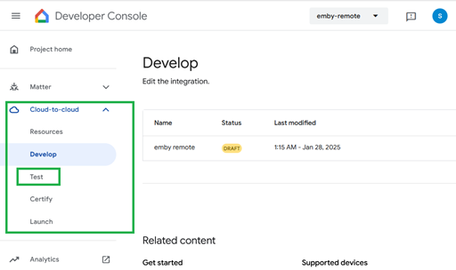
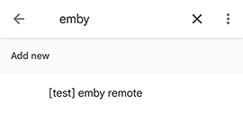
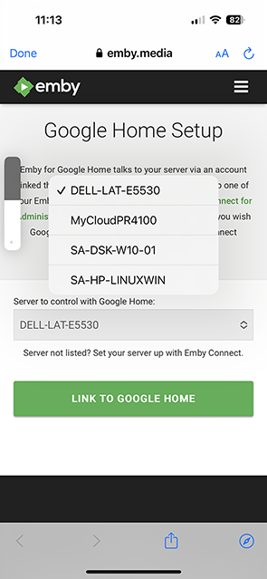
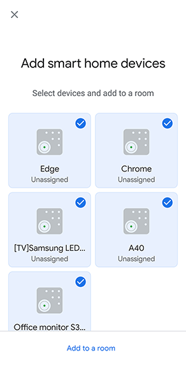

# Emby with Google Home

1. [What is Google Home?](#what-is-google-home)
2. [Get started](#get-started)
    * [Prerequisites](#prerequisites)
    * [Why is Emby connect required?](#why-is-emby-connect-required)
    * [Why is Emby Server Remote Access required?](#why-is-emby-server-remote-access-required)
    * [Alpha stage steps](#alpha-stage-steps)
    * [Emby Remote setup](#emby-remote-setup)
    * [Google Home account linking](#google-home-account-linking)
    * [My server is not available to be selected](#my-server-is-not-available-to-be-selected-what-do-i-do)
    * [I get an error when selecting the server](#i-get-an-error-when-selecting-the-server-what-do-i-do)
3. [Commands](#commands)
    * [How to use Google Home](#how-to-use-google-home)
    * [Playback commands](#playback-commands)
    * [Sync Devices](#sync-devices)

### What is Google Home?  
Google Home is a powerful speaker and voice Assistant. Play your music. Call your friends. Ask it questions. Control your home. It's your own Google, always ready to help.
 
The Emby Skill enables users to control playback of their media library or Live TV on any Emby compatible device. Once you have successfully linked your Emby account to Google Home and have remote access configured on the emby server, you can start controlling playback of your movies, TV shows, music or Live TV on your devices with your voice. 

## Get started  
It is assumed that you already have a Google Home setup. The emby integration with Google Home is currently in alpha test state due to changes made by Google to sunset some functionality. As a result of these changes, the Google Home skill has been renamed from **Emby home** to **Emby Remote**.

### Prerequisites
It is necessary for [Emby Connect](Emby-Connect.md) to be used for the emby server user account and for the emby server to have [remote access](Remote-Setup.md) configured and working. [Secure Connections](https://emby.media/support/articles/Secure-Your-Server.html#using-secure-https-connections) for the Emby Server is not necessary unless you need to use the [Amazon Alexa service](https://emby.media/community/index.php?/topic/92173-alexa-now-requiring-secure-connection-on-port-443/) with emby.  

#### Why is Emby connect required?
Emby connect is used to provide your server information to Google Home.

#### Why is Emby Server Remote Access required?
Remote Access is required because that is how Google Home connects to the server.

### Alpha stage steps
* Get Access - Send a message to [hatharry](https://emby.media/community/index.php?/profile/40940-hatharry/) to request access to the **Emby Remote** project within Google Home. Please provide your Google Home email address. 

* Start Alpha Access - Once access has been granted, go to the [Google Home console](https://console.actions.google.com/) and login with your Google Home account. You will see the **emby-remote** project. Select it and go through the Google Terms and conditions screens. 

You will then need to enable **Emby Remote** testing and the steps to follow are outlined here: [Enable Testing](https://developers.home.google.com/cloud-to-cloud/test#enable-testing). 

You will see a number of versions in the drop-down.

Pick the latest alpha release.

* Feedback - Issues encountered at this stage, should be posted on the forum on [this topic](https://emby.media/community/index.php?/topic/114533-alpha-testers-wanted-for-google-home/).

* Note that **Chromecast** is not compatible due to limitation by Google at this time.

### Emby Remote setup
When using on a smart phone or tablet, you can install the [Google Assistant](https://assistant.google.com/) app to work with the [Google Home](https://home.google.com/intl/en_uk/get-app/) app for the control commands to **Emby Remote**. 

On the smart device, open the Google Home app. 

Select **Devices** tab and then **Add Device**.

Pick type **Works with Google Home**

On the next screen, you will see the list of available skills. 

Use search to look for **Emby Remote**. Just enter **emby** in the search field. This should be find the **emby remote** skill. If not, double check that you have requested to be added to the alpha testing and you have enabled testing within the project web page as outlined above.

#### Google Home account linking
The first time you invoke Emby Home, you will be asked to link your Emby account. Enter your Emby connect credentials and select your server. This will enable the skill and work across all your Google Home devices linked to your Google Account.

You will see the following screens that take you into the Emby Connect login. 

After you sign in with the Emby Connect account, you will see the emby server.

If you have more than one server with user accounts linked to this emby connect account, you eill see a drop-down to pick from. 

Select the server to be used for **Emby Remote** which will now be linked.

You will then be presented with the devices to select and add and pick a room to assign to.

You can link or unlink your Emby account afterwards, by selecting Settings in the Googe Home app and within the Services section, selecting **Works with Google** 

You will see the **emby-remote** skill

Selecting it, will give you the option to unlink or re-link the skill.

#### My server is not available to be selected, what do I do?
If you don't have an Emby account, follow the steps [here](Emby-Connect.md), otherwise:
1. In your server dashboard, Users > Select the Emby user with Emby connect (green cloud icon)
2. Remove the username or email from the Emby connect field, hit save.
3. Re-add the information to recreate the Emby connect link.

#### I get an error when selecting the server, what do I do?
Check that the emby connect data for the emby server are correct. 
1. It is best to do this check on a remote device or PC and not when on the local network. 
2. In a browser, open the https://app.emby.media web page, sign in and and select **Sign in with Emby Connect**.
3. Click on the **...** button for the server and select **Connect**. 
4. If you get an error, establish if the server is accessible from outside the network. If it is not, see [Remote Setup](https://emby.media/support/articles/Remote-Setup.html) 
 

    <b><a href="#">↥ back to top</a></b>

## Commands
### How to use Google Home
* There are a number of ways to send commands to the **emby remote** Google Home skill: 
    **Ask MB Remote {insert command}**
    **Hey Google, Ask MB Remote {insert command}**
    **Hey Google, {insert command}**
  and when using Google Assistant, you can also just say the command. It would route it to **emby remote** if it is a known command for the skill.
* Device names can be changed within the Google Home app by selecting the linked device and then settings. that would make it easier to communicate with Google Home.
* If the device names are changed within Emby Server Settings Devices screen, then it will be necessary to sync devices.

At any time, you can update the linked devices by sending this command,
    **Hey Google, Sync Devices**

### Playback commands
* pause `<device name>`
* resume `<device name>`
* next `<device name>`
* previous `<device name>`
* stop `<device name>`
* mute `<device name>`
* unmute `<device name>`
* seek `<device name>` to `<xx>` minutes
* turn down the volume on `<device name>`
* turn up the volume on `<device name>`
* set `<device name>` volume to `<xx>`%

Selecting the linked device within the Google Home app would show the following controls

### Sync Devices
* sync devices

    <b><a href="#">↥ back to top</a></b>

***