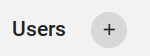
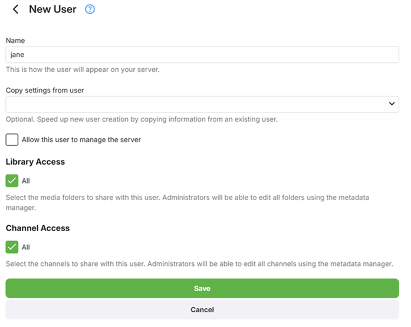
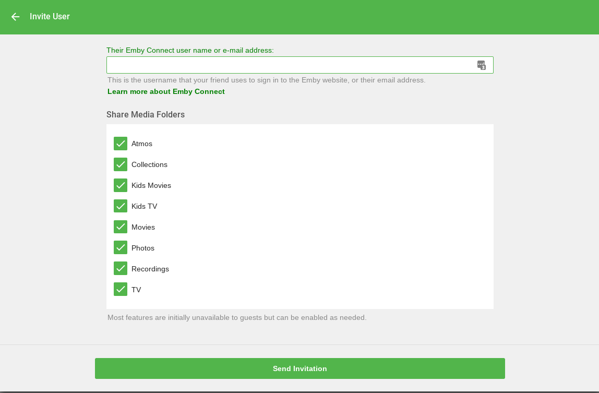
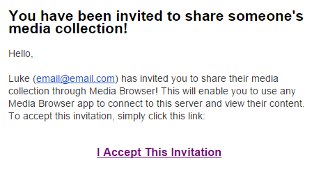
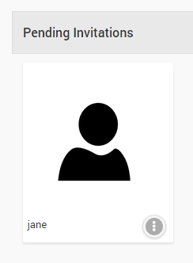
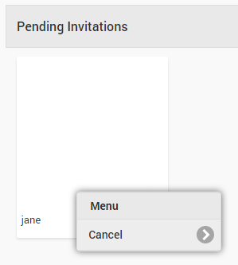

Guests are users that you've invited using [Emby Connect](Emby-Connect). By default Guests have limited permissions but administrators can easily control this to give them access to various features as desired.

## Inviting a Guest

To invite a guest, click the + button next to the Users header. 

Click on "Invite with Emby Connect".

You'll then be prompted to enter their Emby username or email address. 

If they have not signed up for Emby yet, they can do so here:

[http://emby.media/connect](http://emby.media/connect)

Once the invitation has been sent, they will need to accept it by clicking on a link in the invitation email. The invitation will appear similar to the following:

As soon as they accept the invitation, they're ready to start using your server. They'll be able to sign in from any Emby app, including the [online web app](http://app.emby.media).

## Configuring Guest Accounts

Once a guest has been accepted, they can be configured in the same way as a local user. For more information, see [Users](Users).

## Pending Invitations

Guests that you've invited will display as pending until they accept the invitation. 

Invitations can easily be cancelled by clicking the dot menu button:

