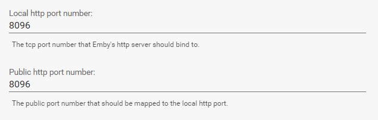
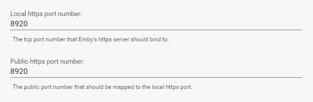
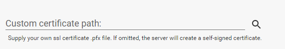
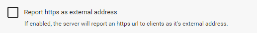
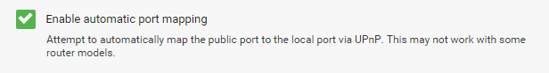

Hosting settings allow you to configure Emby's built-in web server. These settings are accessed by opening the server dashboard and navigating to **Advanced** -> **Hosting**.

For the purposes of this document we are defining local as within your home network, and external as outside your network away from home.

## Http Port

The http port settings allow you to specify both the local, system port that the server should bind to, as well as the external port that the server should use when reporting it's external url to clients.

Generally these two values will be the same, but they can be customized as needed.

## External WAN Address

The server will attempt to automatically detect your external address. The result is displayed on the front page of the server dashboard.

If for some reason you need to customize this value, or it is not detected properly, you can manually enter your external address here:

Most users can leave this blank and rely on the server's automatic detection. If you are using a DDNS, or the Https feature with a self-signed certificate, then you may prefer to customize it.

## Https Port

The local and public https ports can be configured in much the same way as regular http:

In addition you can also supply your own custom SSL certificate. This is highly recommended for https usage. If omitted, the server will create a self-signed certificate.

## Requiring Https

Emby apps use http by default. In order to force them to use https, you can configure the server to report it's default external url as the http url. 

**Note**: Https is a new feature. Some Emby apps may require updates before this option can be used.

## Automatic Port Mapping

By default the server will attempt to automatically map public to local ports by configuring your router. You can disable this as necessary here.

