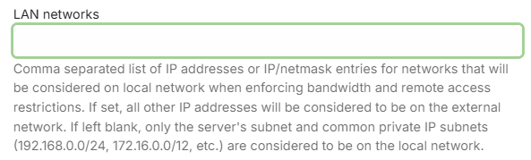
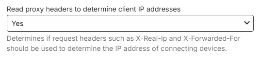
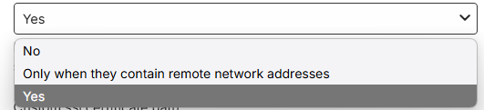
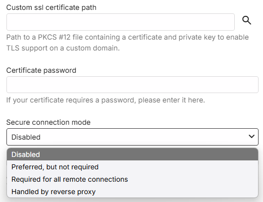
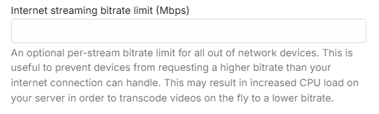

Adjust network settings to configure Emby's built-in web server. These settings are accessed by opening the server dashboard and navigating to **Server** -> **Network**.

For the purposes of this document we are defining local as within your home network, and external as outside your network away from home.

## LAN Networks

If you have more than one local network subnet, you may need to use this setting to define the IP subnets that are deemed to be local. Also if using a vpn on the router, you should use this setting to add the local subnet address range used by the vpn. When there is more than one subnet, enter here all the IP subnets that are to be treated as local network subnets, including the subnet the Emby server is connected to.

This setting is used when enforcing bandwidth controls and remote access controls.

When the LAN Networks field is filled, any subnet not defined here will be deemed external and the remote access controls and external bandwidth restrictions would apply. If left blank, only the server's subnet and common private IP subnets are considered to be on the local network. See example below.

Here is an example of two 256-addresses subnets defined as being local for the server: 192.168.1.0/24,10.253.0.0/24.

> [!IMPORTANT]
> When specifying IP subnets, make sure you use the correct netmask/cidr value. A `/24` denotes 256 addresses

> [!NOTE]
> The system API is used to determine if an IP Address is local. For the 192.168.x.x and 172.x.x.x subnets shown above, there is an override where they would always be classed as local. If you find that your 10.x.x.x subnet is not classed as local, enter the subnet together with the subnet for the server in the **LAN Networks** field.

> [!IMPORTANT]
> You should only use this setting, if you know you need it. Once you configure, you will need to keep it up to date - in event of network subnet changes.

## Local IP Address

The local IP address will automatically be detected by Emby Server and this field should be left blank. But, if you wish to override that, enter here the local IP address that Emby Server should present to Emby apps. An example of when you may need to do that, is for a server with multiple network interfaces and you wish to set a specific network interface. 

> [!Important]
> Ensure the specified IP Address is a static or DHCP reserved IP Address.

## Local Ports

This allows you to specify both the http and https local ports that the server should bind to and use. The https port would be used if secure connections (SSL) are enabled. Whilst the local ports can be customized, it is recommended that you leave them as per the default.

## Allow Remote Access

Remote connections to the Emby Server can be disallowed or allowed using this setting.

> [!Note]
> A similar setting is available for each user account. See [users](Users.md).

When remote connections are enabled, further settings will show that you can customize.

## Remote Connections IP Address Filters

You have the option to restrict remote connections to be allowed only from specific public IP addresses or IP Address subnets. The reverse is also possible, blocking specific remote IP addresses and subnets. When left blank, all remote addresses would be allowed.

## Public Ports

This allows you to specify both the http and https external public WAN ports that the server should use when reporting its external url to Emby clients. The https port would be used if secure connections (SSL) are enabled. By default, these ports are the same as the local port numbers. You can choose alternative port numbers and in some cases - eg if having more than one server with remote connections enabled, you would need to use different public/WAN port numbers. For added security, you may also decide to having a non standard public port number. More details about added security in this article [Secure Your Server](Secure-Your-Server.md).

## Automatic Port Mapping

By default this setting is enabled and the Emby Server will attempt to automatically map public to local ports by configuring your router. It can be disabled at initial setup time or later in the server Network settings.

> [!Important]
> Automatic port mapping uses uPnP which would need to be enabled on the router.

> [!Important]
> If automatic port mapping is disabled but remote connections are to be used, you must setup port forward rules manually in the router configuration. Refer to [Setup Port Forwarding](Connectivity.md#setup-port-forwarding) section for information on this.

## External Domain

When using a Dynamic DNS service (DDNS) or a domain name, enter it here without the port number. Emby apps will use this when connecting remotely. The field should be used when a custom SSL certificate is used for Secure Connections. Example: mydomain.com

## Checking Proxy headers to determine real client IP addresses

The setting is on by default and gives added security where the server checks request headers such as X-Real-Ip or X-Forwarded-For to determine the real IP address of the sender.

Optionally you can disable it or limit it to just check when the headers indicate the request is from an external source.

## Secure Connections (https / SSL)

To enable secure connections, you will need to acquire a certificate and provide the filesystem path to the certificate and the certificate password. By default, use of https for requests made to the server is disabled. The path is to be to a PKCS #12 file containing a certificate and private key to enable TLS support on a custom domain. The Certificate password should be entered if it requires a password.

Three secure connections modes are available to choose from,

- Preferred, but not required
- Required for all remote connections
- Handled by reverse proxy

> [!IMPORTANT]
> Some legacy devices may not be able to connect to the server using https. In such environments, do not use the "Required for all remote connections" mode.

> [!NOTE]
> Please ensure that you are using the latest versions available for Emby Apps.

For detailed information on setting up secure connections, refer to this section [Using secure https connections](Secure-Your-Server.md#using-secure-https-connections) in the [Secure Your Server](Secure-Your-Server.md) article.

## Streaming Controls

With [Emby Premiere](Emby-Premiere.md), you can limit the number of concurrent video streams on the server. By default there is no limit.

> [!Note]
> A similar setting is available for each user account which would override this global setting. See [users](Users.md).

## Internet streaming bitrate limit

You have an option to specify the streaming bitrate limit in Mbps for streaming to remote devices. This limit is per stream. Bandwidth limits are not enforced by default.

> [!Note]
> A similar setting is available for each user account which would override this global setting. See [users](Users.md).
