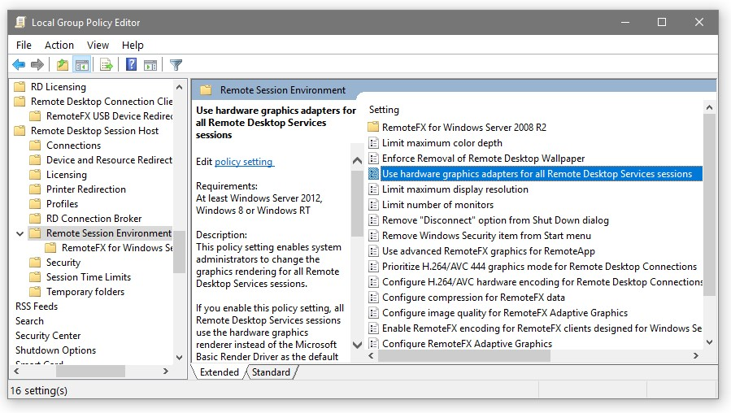

Product: Emby Server
Affected Platforms:	Windows 8.1, Windows 10, Windows Server 2016, Windows Server 2019
Affected Hardware:	Intel QuickSync, AMD AMF, DXVA2 and D3D11VA Codecs

## Symptoms
When you have configured Emby Server to use a hardware video acceleration method that is based on Microsoft Direct3D, you may experience erroneous behavior or total failure of hardware accelerated video processing, when you log in to the computer running Emby Server via MS Remote Desktop Connection, also known as RDP.

## Solution

To avoid this problem, you need to change the configuration of the RDP Session Host on the computer running Emby Server. This can to be done via a Windows Group Policy setting, by following these steps:

1. Open the 'Local Group Policy Editor' via one of the following methods:
  - Open Windows Setting and type 'group' in the search box
  - Open Control Panel  and type 'group' in the search box
  - Start > Run > enter 'gpedit.msc' (without the quotes) and click 'OK'
2. Navigate in the left tree
  - Computer Configuration
  - Administrative Templates
  - Windows Components
  - Remote Desktop Services
  - Remote Desktop Session Host
  - Remote Session Environment

In the right pane, locate the entry highlighted below
('Use hardware graphics adapters for all Remote Desktop Services sessions')

  - Right click the entry and select 'Edit'
  - In the dialog, change the policy setting to 'Disabled' and click 'OK'
  - Reboot the computer

## Background

In recent Windows versions, the RDP service can use video and graphic hardware acceleration for 2D and 3D composition of remote session desktops, in latest versions it can even use H.264 video instead of GDI instructions for delivering the desktop to the client.

When these RDP features are activated and a client connects via Remote Desktop, the RDP Session Host will block all D3D and DXGI for any other use than the local session.

Under these circumstances, and when Emby Server is running in a local session and this session is not the one being logged into via RDP, it can happen that D3D9 based hardware accelerations are still working (sometimes with flaws, though), because D3D9 is always related to a user session context. 

Hardware acceleration based on D3D11 will never work in the described situation.

### Affected Hardware Codecs
#### Direct3D 9

QuickSync Video Decoders
(without D3D11 in the name)
QuickSync Video Encoders
(without D3D11 in the name)
AMD AMF Encoders
DXVA2 Decoders

#### Direct3D 11

QuickSync D3D11 Video Decoders
QuickSync D3D11 Video Encoders
D3D11VA Video Decoders
