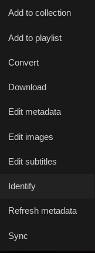
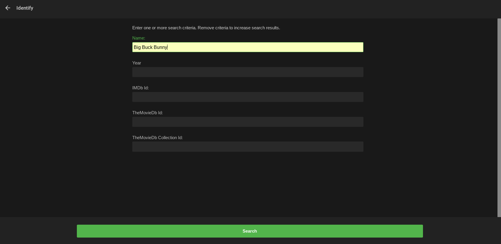
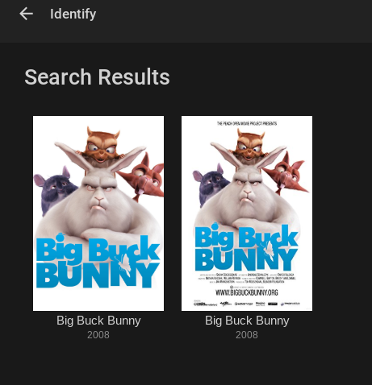
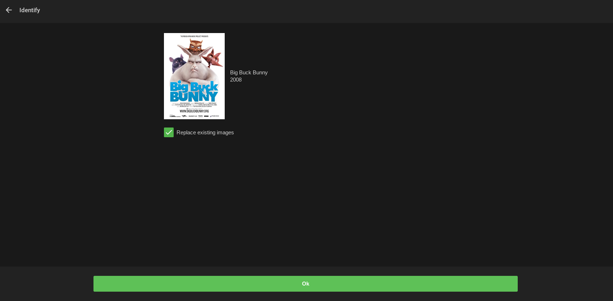

On occasion, content may be mismatched as something else.

To correct this, there is the **IDENTIFY** option available on a per-item basis. 

In the web app open the item's detail screen, click the 3-dot menu and then then click Identify. 

You can use the Identify tool to match it to internet metadata.

Try the name to start with, or enter as much information in the fields as possible to get the best match.

If a choice is returned, then choose the correct one.

Now confirm your selection.

Note: The **IDENTIFY** option is only available for Emby administrators.
