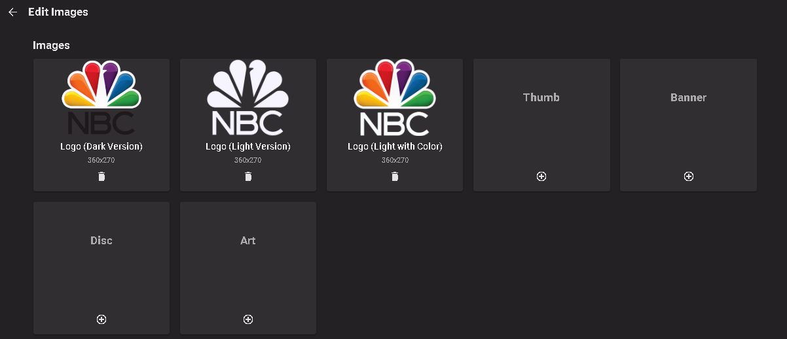
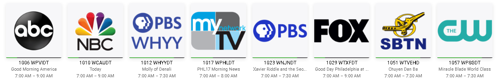
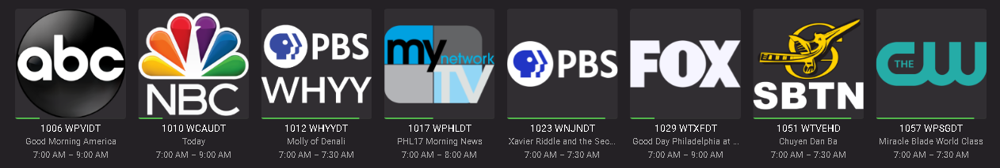
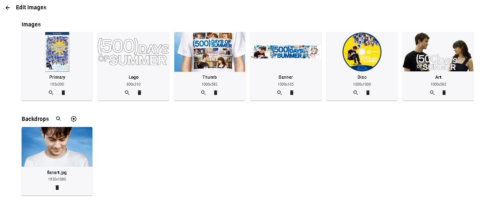
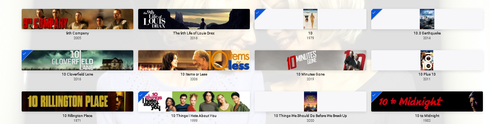
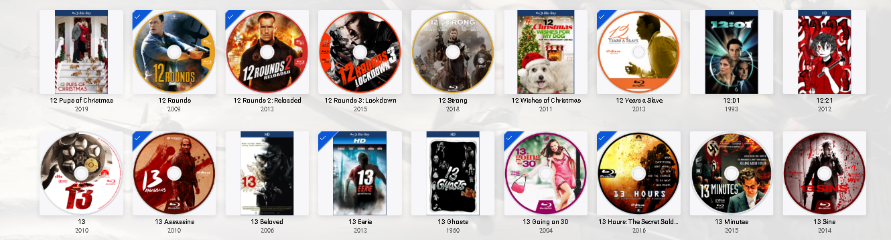
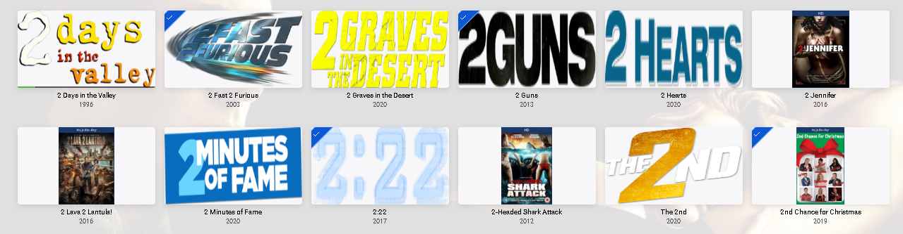
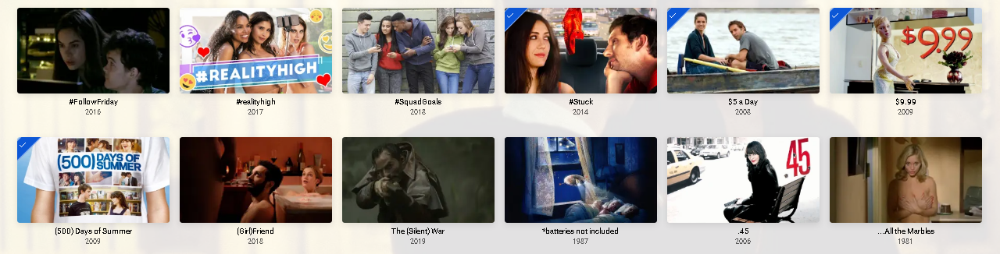

## Live TV
Primary - This channel logo is the historic logo used for channels and third party plugins. On newer Emby clients it is used on light colored backgrounds.

LogoLight & LogoLightColor - This channel logo is used on dark colored backgrounds. LogoLightColor is the default logo used but options in clients may allow for use of LogoLight as well.

Here is a example of editing graphics for a Live TV station:

Here are two examples showing how these images are used depending on the background color in use.

## Other Content Types Like Movies & TV Shows

If you edit the graphics for a movie or show you would have a screen similar to this.

Here is an example screen showing some of these graphics in use:

Here is a banner view (vs coverart) view of a movie library.  Note in this picture not all movies have a banner so the primary image will be used for images without a banner.

Here is a disc view (vs coverart) view of a movie library.  Note in this picture not all movies have a disc so the primary image will be used for images without a disc.

Here is a logo view (vs coverart) view of a movie library.  Note in this picture not all movies have a logo so the primary image will be used for images without a logo.

Here is a thumb view (vs coverart) view of a movie library.  Note in this picture not all movies have a thumb so the primary image will be used for images without a thumb.

##### Primary
This is the normal cover art used.

##### Logo
Option image usually superimposed over backdrops

##### Backdrops/Fanart
This is the background used behind all other graphics and text.  Many clients can alternate these backgrounds if more than one graphic is present.

##### Thumb
Used for thumbnail views

##### Banner
Used for banner views

##### Disc
Used for disk views

##### Art 
Used in some clients similar to the Logo image type