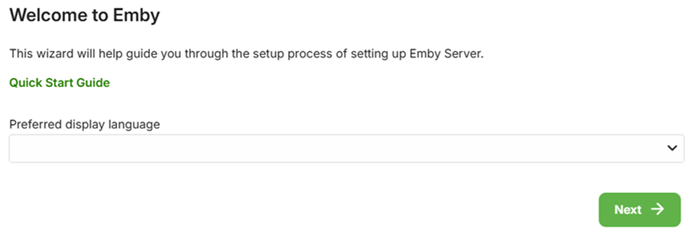
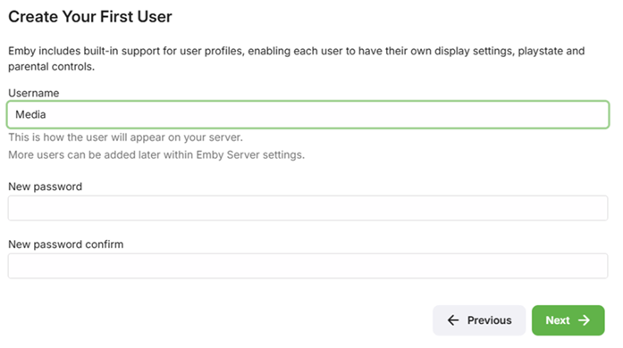
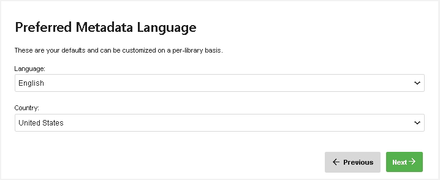
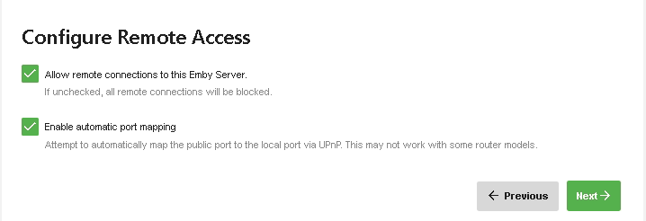

Emby Server is available on the following platforms:

* Windows
* Mac
* Linux
* BSD
* NAS Devices - Asustor, FreeNAS, Open Media Vault, QNAP, [Synology](../wiki/Synology-:-Help-and-Support).
* Docker
* Android

To install Emby Server, begin by visiting the download page and following the instructions for your operating system:

http://emby.media/download/

## Running the Startup Wizard

After Emby Server has been installed, it will attempt to launch the startup wizard in your default browser. If this does not occur automatically, please open your web browser and navigate to:

[http://localhost:8096/web/wizardstart.html](http://localhost:8096/web/wizardstart.html)

### Language Selection

The first page will ask you to choose a display language. We have been working hard to translate Emby into as many languages as possible, and the available options are displayed on this page.

### Create a User

Next you'll be asked to create an initial user account. You'll have the ability to create more accounts later after the setup process has completed. 

As an option, you also have the ability to link the account to [Emby Connect](Emby-Connect). Emby Connect makes it easy to connect to your Emby Server while you're away from home. This is purely an optional step and can be skipped if desired. You can always do this later after completing the startup wizard by visiting the [Users](Users) section of the server's web interface.

### Add Media Libraries

Now, you'll add your media libraries. See [Library Setup](Library-Setup) for more information.

## Configure Metadata Language Settings

Once you have added all the libraries that you want, you'll configure your default metadata settings, such as where they'll get saved and in what language.

## Remote Access

If you wish to access your Emby server remotely (outside of your LAN), then you can set up initial options here.

Further Remote Access options are available in the Emby server dashboard (Advanced/Hosting).

## Emby Terms of Service

Accept the Emby Terms of Service

## Completing the Startup Wizard

Once you've completed the above screens, you'll then be taken to the Emby Server Dashboard. You're now ready to explore the features of the server while waiting for your media scan to complete.

Be sure to check out:

* [Users](Users)
* [Sync](Sync)
* [Live TV](Live-TV)
* [Plugins](Plugins)

## Get Emby Premiere

Emby Premiere brings a number of additional benefits and bonus features. With Emby Premiere you can enjoy:

* Cover Art
* Mobile Sync
* Cloud Sync
* Much more

[Learn more about Emby Premiere.](http://emby.media/donate).