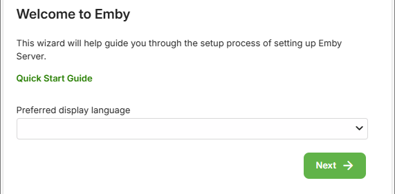
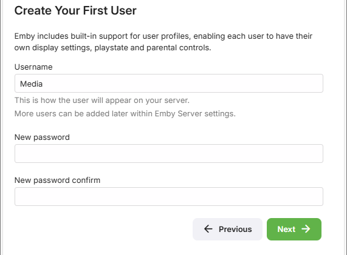
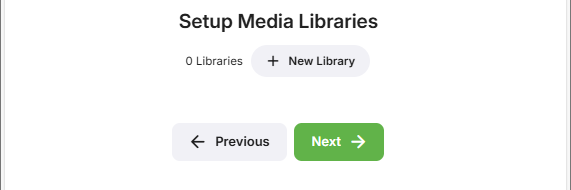
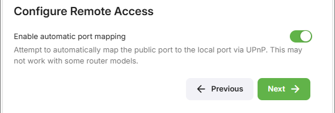
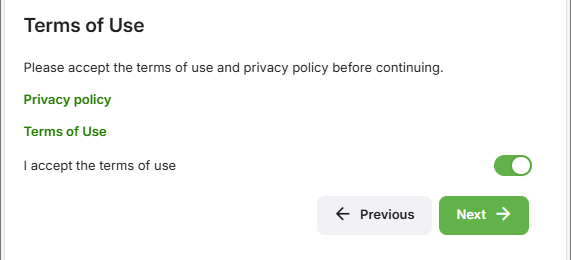
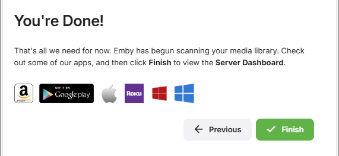

Emby Server is available on the following platforms:

* Windows
* Mac
* Linux
* BSD
* NAS Devices - Asustor, FreeNAS, Netgear, Open Media Vault, QNAP, Synology, Terramaster, Thecus, TrueNAS, TrueNAS Scale, unRAID, Western Digital
* Docker
* Android
* Cloudron
* SNAP 
* Flatpack
* NVIDIA Shield

To install Emby Server, begin by visiting the download page and following the instructions for your operating system:

http://emby.media/download/

## Running the Startup Wizard

After Emby Server has been installed, it will attempt to launch the startup wizard in your default browser. If this does not occur automatically, please open your web browser and navigate to: [http://localhost:8096](http://localhost:8096) which should launch the Startup Wizard.

### Language Selection

The first page will ask you to choose a display language. We have been working hard to translate Emby into as many languages as possible, and the available options are displayed on this page.

### Create a User

Next you'll be asked to create an initial user account. Enter the Username and password. You'll have the ability to create more accounts later after the setup process has completed. See [Users](Users.md).

### Add Media Libraries

Now, you'll add your media libraries. See [Library Setup](Library-Setup.md) for more information.

## Configure Remote Access

Automatic port mapping for remote access can be enabled or disabled at this initial stage:

Further Remote Access options are available in the Emby server dashboard which you can access after the initial setup. See [Network Setup](Hosting-Settings.md).

## Emby Terms of Service

Accept the Emby Terms of Service

## Completing the Startup Wizard

Once you've completed the above screens, you'll then be taken to the Emby Server Dashboard. You're now ready to explore the features of the server while waiting for your media scan to complete.

Be sure to check out:

* [Network Setup](Hosting-Settings.md)
* [Server Settings](Server-Settings.md)
* [Users](Users.md)
* [Library Setup](Library-Setup.md)
