Requires Emby Server 4.7 or later and an [Emby Premiere](Emby-Premiere.md) subscription.

## Configure a TV Library in Emby Server

In order to use Intro Skip a TV Show library needs to be configured. Edit a TV Library on the Emby Server console.  Scroll down to the Markers section in the library and change the option from Never to either "as a scheduled task" or "as a scheduled task and when media is added" depending on your particular needs.

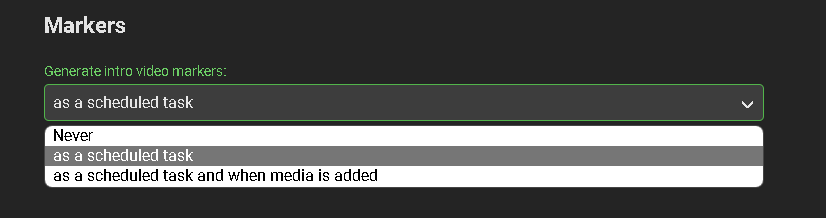

Once configured, optionally go to Scheduled Tasks Menu and you'll see a new Task "Detect Episode Intros" added in the Library section.

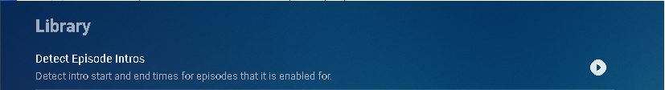

By default this task is set to run every 24 hours.

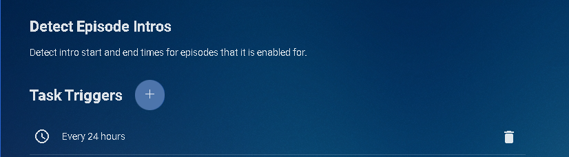

You can optionally adjust this task to run at a specific time. To add a new Task click the + sign above.

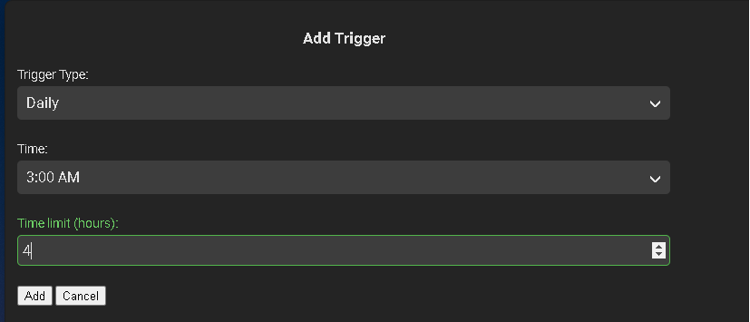

This shows a new schedule that starts at 3 AM and runs for up to 4 hours.

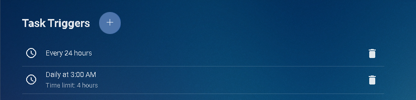

We can now click the trashcan icon to remove the 24 hours schedule:

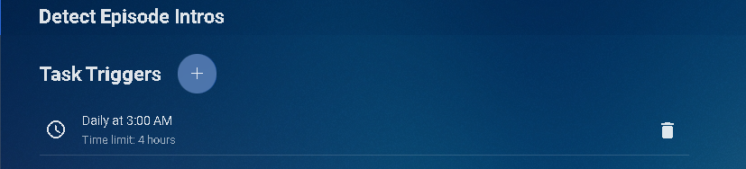

#### Run Detect Episode Intros Manually

The Detect Episode Intros can easily be run manually at any time by clicking the the arrow key.  The task will change to a progress bar like this:

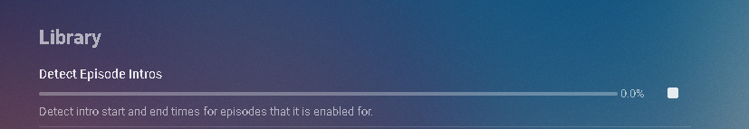

Nothing more need be done on the Emby Server.

> [!NOTE]
> The server will process all TV Show episodes in the background.
This process may take a while depending on the number of episodes you have.. 

## Configure Emby Client for Automatic or Manual Intro Skip

Each client can be set to ignore TV Show Intros, automatically use Intros, or to prompt use showing a button.  You can set this option in the client option's Playback Menu.

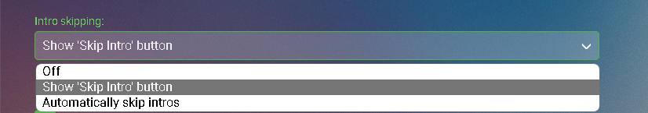

### Using Intro Skip

With the Skip Intro button selected you can clearly see the button on the OSD immediately at the start of playback. The timeline is still at 0:00 before the show has started to play and we can already skip the introduction of the show.

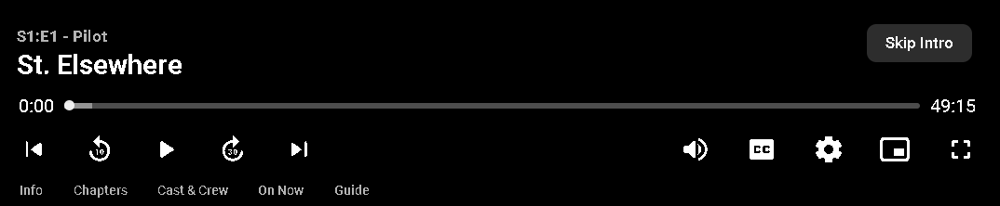

Clicking the Skip Intro button immediately jumps right to the start of the Episode.

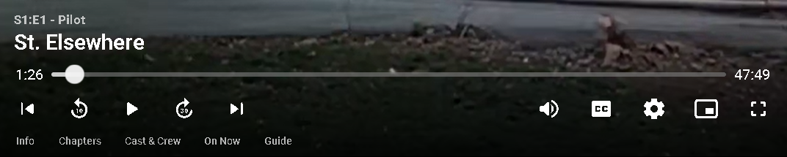

With the client option set to Automatically skip intros our TV show intros have been put on auto pilot. 

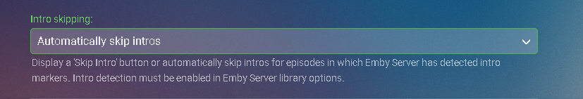

Right at the start of playback it jumps to the end of the intro right at the point of the fade in.

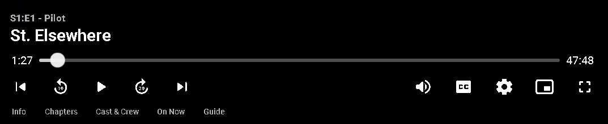

## Intro Skip on Emby for LG Smart TVs

New to LG 1.0.37 is the ability to skip TV Show Episode Introductions segments. This allows you to jump right to the start of the action, saving a great deal of time allowing you to quickly get to the good stuff! Combine Into Skip with Automatic Play Next Episode for a superior binge-watching experience!
