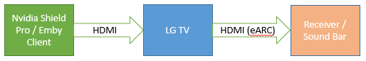
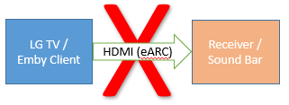

Why does the Emby App for my LG TV not play the Dolby Atmos TrueHD Audio without Transcoding?

by rbjtech

Why does the Emby App for my LG TV not play the Dolby Atmos TrueHD Audio without Transcoding?

## Background
There are two primary types of Audio that can be played with Media files – 

Compressed Audio (ie AC3/AAC/DTS Core etc) and Uncompressed (or HD) Audio (ie True-HD, DTS-HD etc)

Compressed Audio uses a lot less data (bitrate) and thus is used for streaming services such as Netflix while HD Uncompressed Audio is the primary audio on ‘physical’ media such as Blu-Ray or Ultra HD Blu-Ray disks because they have much more capacity to store the data.   ‘Rips’ of this physical media may contain the HD Audio streams, the result is a technical scenario that was outside the scope of the original LG architecture design.

### Where does Atmos come in?

Dolby Atmos is a technology where the sound is given additional data to allow it to use extra positional speakers that you may have as part of your AV Sound setup.    Generally, these are ‘height’ speakers that give you the full 360 degrees experience.

Atmos data can be applied to both Compressed Audio (in the form of Dolby Digital PLUS – EAC3) and HD Audio in the form of True-HD (THD).

### How can I get Emby to play Atmos using my Sound Bar or AV Receiver?

As most people connected their DVD/Blu-Ray Player directly to the TV itself, a standard called ARC (Audio Return Channel) was introduced to pass the Audio back FROM the TV to the external amplifier.  This was originally via Optical or Co-Ax cable but these days it’s via HDMI.  This was great for DD/DD+/DTS compressed sound, but it was never designed for uncompressed sound as the hardware was not available.

> [!NOTE]
> Streaming services/Internal LG Emby Client will use the ARC interface to pass DD+ Atmos (compressed) to a soundbar or Receiver without issue.

For HD Audio however, a new standard was introduced called ‘eARC’ or Extended ARC.  This only works over HDMI and importantly both the TV Hardware, TV Software/Firmware and Amplifier must all support eARC.

## This is where the LG problem lies

On 2019 Models and later, the TV Hardware supports eARC but only from External Sources NOT the TV itself.  As the Audio from the Emby LG Client is being generated ‘internally’ in the TV, then the hardware to use eARC is simply not available.  Unfortunately, no firmware update can ever fix this, as the physical hardware ‘link’ is missing – a massive oversight from LG on even their newest 2020 TV’s.

So in summary, you have two options to play HD Audio Dolby Atmos

### Option 1

If your LG TV is year 2019+ and has eARC, then you can pass the HD Audio to your Receiver or Soundbar by means of an External Player via the TV eARC HDMI Interface.  

### Option 2
 

If your LG TV does not have eARC, then you can pass the HD Audio to your Receiver or Soundbar(*) directly by means of an External Player. Video only is then passed to the LG TV. No ARC or eARC is required. (*) Note the soundbar/receiver must have an HDMI passthough interface.

Connecting the LG TV directly to the ARC or eARC enabled Receiver/Soundbar will only work for compressed Audio (DD,DD+), it will not work for HD Audio without Emby transcoding the streams.

