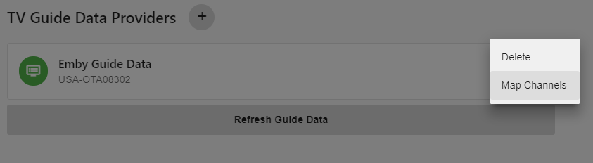
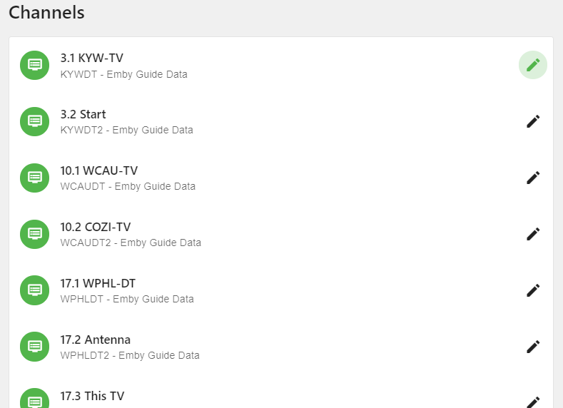
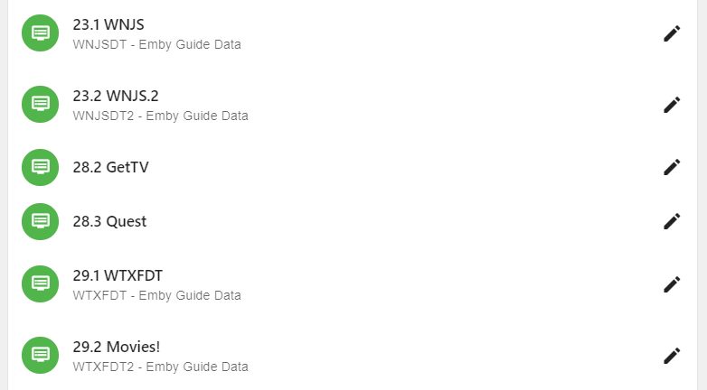
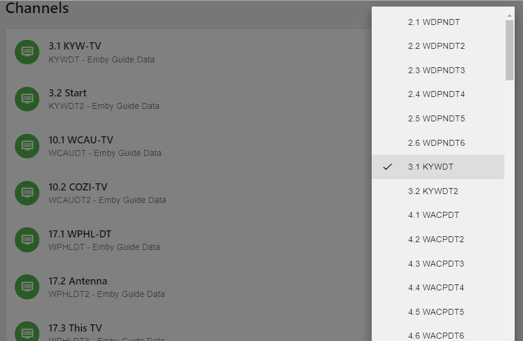

The last thing to do after setting up your tuner and guide data provider is to map your channel lineup.

Emby tries to automate as much of the mapping as possible.  What we are doing in this process is mapping a station id from our tuner lineup to the same station in our guide data.  This is how Emby links the data to each station when presenting the EPG (Electronic Programming Guide) in the different Emby Client Applications.

In this example we will start with the Emby Guide Data we setup in the tutorial.

Click the 3 dots on the right side of the Data Provider and it will popup a small menu.  This is also how you remove a guide provider but right now we are interested in mapping channels so we will click on Map Channels.

If Emby is able to automatically map your channels it will look similar to above.  Notice the top line is the channel reported by the Tuner. Underneath it is the channel data from the guide provider.  Each of the above has a match.  All we need to do is revew them to make sure they all matched correctly.

Here is an example where Emby was not able to automatically match the tuner channel to the Guide Provier.  Notice 28.2 GetTV and 28.3 Quest have no guide linked.

To manually map a channel we click the pencil icon to the right of the channel.

This brings up a list of channels that can be scrolled.  To change the channel mapping click on the station in popup channel list.  In this example we are editing the first station 3.1 KWY-TV. The check mark on the popup channel list conveniantly shows the currently selected mapping. We can change this by clicking any other channel.

That is all there is to channel mapping.

Note: In some cases you may find channels missing from the guide. This can happen especially with OTA guide data.  Often times if you are close to market boundaries you may have to add a 2nd guide using a different postal code.  If you are fortunate enough to be able to pickup channels from separate broadcast markets this will almost all be the case (need for additional guide data provider).

Sometime you may need to try a different postal code closer to the broadcast towers.  Don’t be afraid to try a few postal codes to get the guide data you need.

In the event you’re setting up a cable provider and find missing channels, please report this to your provider. In the case of Emby Guide Data, please report this in the forums.
