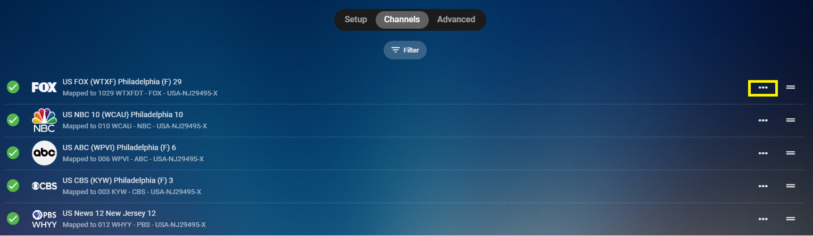
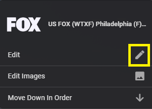
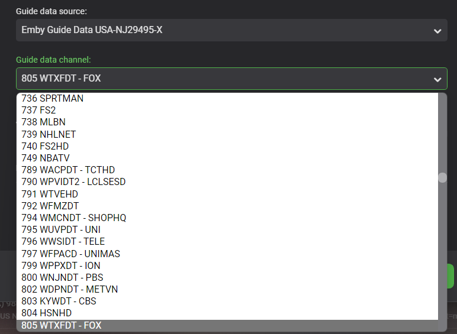

The last thing to do after setting up your tuner and guide data provider is to map your channel lineup.

Emby Server will try to automate matching of your channels to any guides you have setup for this tuner. You can manually change any channel by picking the guide, then the Station.

From the Live TV menu, click the Channel tab at the top of the screen.  Click the 3 dot menu to the right on any channel you wish to edit.

Click the Edit button on the popup screen.

You can now select the Guide Provider to use as well as the station from that Guide.

Click the Save Button when done editing this channel.

You can do the same thing from the Guide itself.  Click the left most column that has the station information.  Click the 3 dot menu on the next screen you get which will be the same as above.

> [!Note}
> In some cases you may find channels missing from the guide. This can happen especially with OTA guide data. Often times if you are close to market boundaries you may have to add a 2nd guide using a different postal code. If you are fortunate enough to be able to pick up channels from separate broadcast markets this will almost always be the case (need for additional guide data provider).

Sometimes you may need to try a different postal code closer to the broadcast towers. Don’t be afraid to try a few postal codes to get the guide data you need. Emby Server is very flexible and allows you to add multiple guides so please make use of this functionality if you need to.

In the event you’re setting up a cable provider and find missing channels, please report this in the forums.