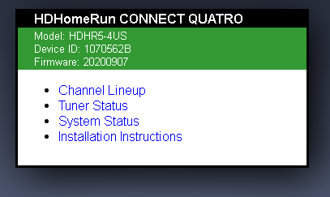

This is a great way to remove SD channels when you only want the HD version or an easy way to remove channels you don't want like HSN, QVC or channels in foreign languages.

Open a browser and type http://my.hdhomerun.com/ and you'll get a screen similar to this:

Click on your tuner and you'll get a screen similar to this:

Click on the Channel Lineup and you'll get a screen similar to this:

The very first column above has stars or Xs.  Click on the icon and you'll see it empty, yellow star or red X. It changes on each click.

- Yellow: Favorite Station
- Red X: Do not use
- Blank: No decision made

So any station you don't want available you mark with the Red X.
Any station you specifically want Emby to load can be marked Yellow.

Any station "blank" (not yellow or red) is available in other apps but won't be imported into Emby.
For example you might leave QVC, HSN, and infomercial channels blank so they are available outside Emby.

Now in Emby go to your Live TV setup and click on your HDHomeRun and you'll have a screen like this:

Make sure the first option is enabled to only import your favorites.  
Click Save

Emby will now reload your channels only pulling your favorites. It will reload your guide data and then remove the non-favorite channels from your lineup!