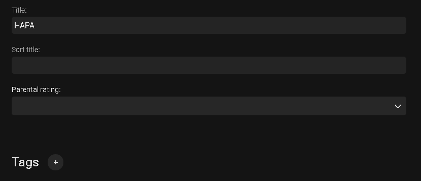

To hide a specific channel from the Guide for specific users.

Edit a TV Channel Metadata from the web admin by hovering over the channel and clicking the 3 dot menu.

Select the Edit Metadata option.

You can now set a sort title that will over ride the normal title sorting.  You can use the Parental rating field above to set the rating AND then use individual user parental control restrictions to hide channels from specific users using either the parental rating field above or a tag (see below)

You can also click the + sign next to Tags and set a Tag such as "HideChannel".

Once you've adjusted your channels you can set restriction per user using Parental Control restrictions per user.